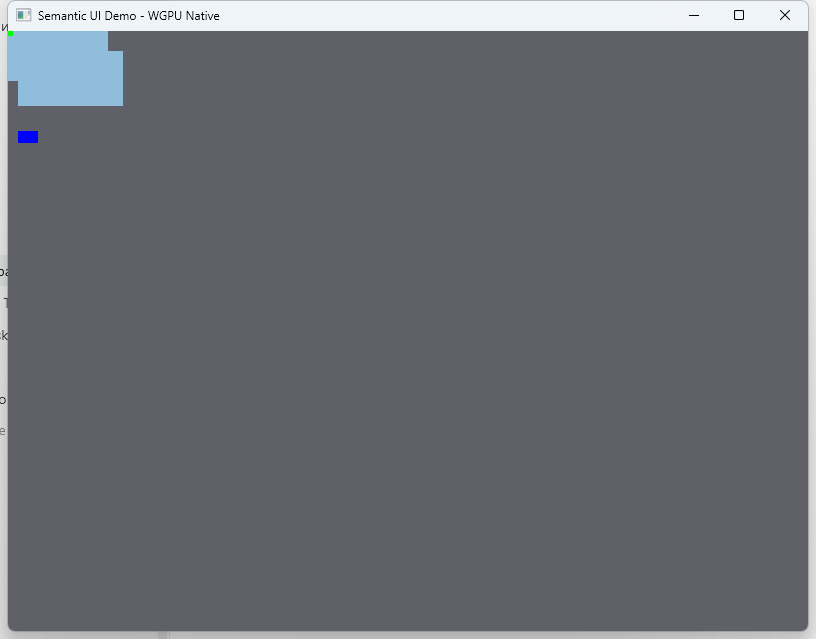

<p align="center">
  
</p>

# Semantic Language

<p align="center">
  <strong>A deterministic, verifier-first language platform for reasoning programs and explicit four-state logic.</strong>
</p>

<p align="center">
  <a href="docs/getting_started.md"></a>
  <a href="docs/spec/index.md"></a>
  <a href="docs/roadmap/v1_readiness.md"></a>
</p>

<p align="center">
  
  
  
  
  
</p>

Semantic compiles `.sm` source into a versioned `.smc` **SemCode** artifact, checks that artifact at a dedicated verifier boundary, and executes admitted code in a deterministic virtual machine.

```text
.sm source
   -> frontend and semantic analysis
   -> deterministic IR
   -> SemCode (.smc)
   -> verifier admission
   -> deterministic VM
   -> optional capability-controlled host boundary
```

> [!IMPORTANT]
> Semantic is an active R&D platform, not a finished general-purpose language product. The published stable line is `v1.1.1`; a narrow practical contour is qualified for limited release; current `main` contains additional landed and benchmark-qualified work that is not yet part of the stable promise.

## Why Semantic?

Most languages model a proposition as either `true` or `false`. Real systems often need two additional states: **not enough evidence** and **conflicting evidence**.

Semantic makes that distinction explicit with the native `quad` type:

| Value | Meaning |
|---|---|
| `N` | unknown / no sufficient evidence |
| `F` | false |
| `T` | true |
| `S` | conflict / incompatible evidence |

A `quad` is not an unusual spelling of `bool`. Branching remains explicit:

```sm
if state == T {
    // confirmed true
}

if state == S {
    // conflict must be handled deliberately
}
```

This is useful for:

- rule and decision systems;
- semantic state machines;
- safety and admission policies;
- evidence-aware computation;
- deterministic programs that must expose uncertainty instead of hiding it.

## Try Semantic

### Prerequisites

- a current Rust toolchain;
- Git;
- Windows, Linux, or macOS.

### 1. Clone and build

```bash
git clone https://github.com/skulmakov-oss/Semantic.git
cd Semantic
cargo build --bin smc --bin svm
```

The repository currently builds the CLI from source. A polished end-user installer or package-manager distribution is not yet the primary onboarding route.

### 2. Run a canonical example

```bash
cargo run --bin smc -- run examples/canonical/rule_state_decision/src/main.sm
```

This example demonstrates records, `quad`, explicit branch decisions, `Result`, verifier-first execution, and a deterministic assertion.

### 3. Inspect the full source-to-artifact path

```bash
cargo run --bin smc -- check examples/canonical/rule_state_decision/src/main.sm
cargo run --bin smc -- compile examples/canonical/rule_state_decision/src/main.sm -o decision.smc
cargo run --bin smc -- verify decision.smc
cargo run --bin smc -- run-smc decision.smc
cargo run --bin svm -- disasm decision.smc
```

Expected flow:

```text
check source
  -> compile SemCode
  -> verify artifact
  -> run admitted artifact
  -> inspect disassembly
```

## Your First Semantic Program

Save this as `decision.sm`:

```sm
fn decide(sensor: quad, ready: bool) -> quad {
    if sensor == N { return N; }
    if sensor == S { return S; }
    if ready == true { return T; }
    return F;
}

fn main() {
    let verdict: quad = decide(T, true);
    assert(verdict == T);
}
```

This follows the canonical compact guard-return style frozen in
[`docs/spec/source_style.md`](docs/spec/source_style.md).

Check and run it:

```bash
cargo run --bin smc -- check decision.sm
cargo run --bin smc -- run decision.sm
```

Compile and verify it explicitly:

```bash
cargo run --bin smc -- compile decision.sm -o decision.smc
cargo run --bin smc -- verify decision.smc
cargo run --bin smc -- run-smc decision.smc
```

### Visible output on current `main`

Current `main` also contains a narrow, capability-controlled `print(text)` path:

```sm
fn main() {
    print("Hello, Semantic");
}
```

This path is benchmark-qualified on current `main`, but it is deliberately **not** a claim of unrestricted stdout, formatting, file I/O, stdin, networking, or a broad host ABI.

## What Works Today

The repository contains more than a parser prototype. The following paths are implemented and covered by current specs, examples, or qualification evidence.

### Qualified practical contour

- functions, locals, `if / else`, `return`, and explicit `match`;
- native `quad`, `bool`, `i32`, `u32`, and `unit` families in the admitted contour;
- records and rule/state-oriented programs;
- explicit `Option` and `Result` control flow;
- built-in `Sequence(T)` iteration;
- direct-record user-defined `Iterable` dispatch;
- direct local helper imports in the admitted bare and selected forms;
- source -> semantic analysis -> IR -> SemCode -> verifier -> VM execution.

### Landed and benchmark-qualified on current `main`, not yet promised as stable

- same-family `i32` arithmetic and comparisons;
- mutable locals and reassignment;
- `while`, `loop`, `break`, and `continue`;
- bounded `text`, concatenation, and explicit `to_text`;
- persistent `Sequence(T)` helpers and functional `Map(K, V)` operations;
- deterministic seeded pseudo-random helpers;
- narrow capability-controlled `print(text)` observation;
- bounded project-root command routes.

### Additional landed work on current `main`, not yet qualified

- schema and boundary-core work;
- package-baseline widening beyond the bounded project-root contour;
- first-wave closures and generics;
- first-wave UI/application boundary work;
- broader module, iterable, and language-surface work beyond the admitted limited-release slice.

For the detailed and continuously maintained classification, use the [Feature Maturity Matrix](docs/status/feature_maturity_matrix.md).

## Status: Stable, Qualified, and Current-Main Are Different

Semantic uses explicit status vocabulary so that implemented work is not silently advertised as a stable promise.

| Status | Meaning |
|---|---|
| **Published stable** | Promised by the published stable line, currently `v1.1.1`. |
| **Qualified limited release** | Proven in a bounded practical contour by qualification evidence. |
| **Landed on current `main`, not yet promised** | Implemented or benchmark-qualified, but not promoted into the stable or qualified release promise. |
| **Out of scope** | Deliberately excluded from the current release contour. |

Current top-level posture:

- Semantic is **not** presented as production-ready;
- Semantic is **not** yet a broad general-purpose ecosystem;
- current `main` is wider than the published stable line;
- UI and Workbench do not own compiler, verifier, VM, or runtime truth;
- stable promotion requires an explicit release decision, matching specs, and evidence.

Read the authoritative documents when status precision matters:

- [Semantic v1 Readiness](docs/roadmap/v1_readiness.md)
- [Public Status Model](docs/roadmap/public_status_model.md)
- [Public Maturity Snapshot](docs/roadmap/public_maturity_snapshot.md)
- [Feature Maturity Matrix](docs/status/feature_maturity_matrix.md)

## How Execution Is Controlled

Semantic separates construction, admission, execution, and external effects.

```text
source describes intent
  -> compiler lowers it
  -> emitter creates SemCode
  -> verifier admits or rejects the artifact
  -> VM executes under quotas and deterministic rules
  -> capability boundary controls optional host effects
  -> audit layer records controlled effects where supported
```

### The compiler does not execute source directly

Source is parsed, checked, lowered, and emitted as SemCode. This keeps source semantics separate from runtime execution.

### The verifier is a real boundary

Persisted `.smc` execution must not bypass verification. Malformed bytecode, invalid control flow, unsupported capabilities, incompatible metadata, and resource-bound violations belong at the admission boundary.

### The VM is deterministic and bounded

Given the same admitted SemCode, runtime configuration, capability context, and input boundary, execution is expected to produce the same result, trap class, and observable behavior.

### Host effects are explicit

The VM does not receive unrestricted authority over the host. Effects cross the PROMETHEUS integration layer through explicit ABI and capability contracts.

<p align="center">
  
</p>

## CLI Cheat Sheet

`smc` is the canonical user-facing toolchain command. `svm` is the lower-level VM-oriented entrypoint.

| Command | Purpose |
|---|---|
| `smc check <file.sm|project-root>` | Parse and semantically check source. |
| `smc run <file.sm|project-root>` | Compile and execute from source through the standard route. |
| `smc compile <input> -o app.smc` | Produce a SemCode artifact. |
| `smc verify app.smc` | Admit or reject the artifact without running it. |
| `smc run-smc app.smc` | Execute a persisted artifact through the verified route. |
| `smc disasm app.smc` | Inspect SemCode instructions. |
| `smc dump-ast <input>` | Inspect the parsed source model. |
| `smc dump-ir <input>` | Inspect lowered IR. |
| `smc lint <file.sm>` | Run lint-oriented checks. |
| `smc fmt <path>` | Format Semantic source. |
| `smc explain <code>` | Explain a diagnostic code. |
| `smc repl` | Start the interactive check-oriented REPL. |
| `smc 7hell <file.sm> [--json]` | Run the diagnostic/readiness qualification path. |
| `svm run app.smc` | Run SemCode through the lower-level VM entrypoint. |
| `svm disasm app.smc` | Disassemble SemCode through the VM entrypoint. |

The complete current command contract is in [docs/spec/cli.md](docs/spec/cli.md).

## Project-Root Workflow

Current `main` supports a bounded project-root baseline using the existing `semantic.toml` or `Semantic.package` layouts represented by repository fixtures and tests.

From a supported project root:

```bash
smc check .
smc run .
smc compile . -o app.smc
```

This is not yet a complete package ecosystem. It does not claim a public registry, dependency solver, multi-package workspace manager, or `smc new` scaffolding.

When running from this repository without installing the binaries, prefix commands with:

```bash
cargo run --bin smc --
```

## Examples

Start with the curated examples under `examples/canonical/`.

| Example | Demonstrates | First command |
|---|---|---|
| [rule_state_decision](examples/canonical/rule_state_decision/) | `quad`, records, `Result`, explicit decisions | `smc run examples/canonical/rule_state_decision/src/main.sm` |
| [text_core](examples/canonical/text_core/) | bounded text, concatenation, `to_text`, controlled output | `smc run examples/canonical/text_core/src/main.sm` |
| [loop_control_flow](examples/canonical/loop_control_flow/) | `while`, `loop`, `break`, `continue` | `smc run examples/canonical/loop_control_flow/src/main.sm` |
| [collections_core](examples/canonical/collections_core/) | practical collection operations | `smc run examples/canonical/collections_core/src/main.sm` |
| [option_result_control_flow](examples/canonical/option_result_control_flow/) | explicit absence and failure paths | `smc run examples/canonical/option_result_control_flow/src/main.sm` |
| [cli_batch_core](examples/canonical/cli_batch_core/) | sequence-driven batch classification | `smc run examples/canonical/cli_batch_core/src/main.sm` |

The benchmark suite also includes a deterministic headless Snake program:

```bash
cargo run --bin smc -- run examples/benchmarks/snake_core.sm
```

See the [Examples Index](docs/examples_index.md) for the complete curated list and the intentional boundary example.

## Repository Map

Semantic is a Rust workspace with narrow ownership boundaries.

```text
Semantic/
├── crates/sm-*                 language construction, SemCode, verifier, VM, CLI
├── crates/prom-*               capability, ABI, state, rules, audit, UI boundary
├── crates/semantic-core-*      low-level core capsule and execution substrate
├── crates/core-lab             isolated core experimentation and qualification
├── examples/                   canonical programs, benchmarks, boundary examples
├── docs/spec/                  canonical public contracts
├── docs/architecture/          system and ownership design
├── docs/roadmap/               maturity, readiness, and release control
├── tests/                      integration and public-contract evidence
├── reports/                    qualification and gate evidence
└── assets/                     branding and repository assets
```

High-level ownership:

| Layer | Responsibility |
|---|---|
| **Language construction** | lexer, parser, semantic analysis, IR, deterministic passes, SemCode emission |
| **Execution** | SemCode verification, runtime quotas and traps, deterministic VM execution |
| **PROMETHEUS integration** | host ABI, capabilities, gates, state, rules, orchestration, audit |
| **UI / application** | operator-facing display and application shell; never execution authority |
| **Core capsule / laboratories** | low-level execution-core and quad substrate qualification without creating a second language surface |

### Compatibility perimeter

The repository intentionally retains a narrow compatibility perimeter:

- `crates/ton618-core` — compatibility-named low-level primitives;
- `src/bin/ton618_core.rs` — retained compatibility launcher;
- `ton618_legacy/` — historical source archive.

These paths are not second owners of Semantic architecture. New language, execution, and integration work belongs in the canonical `sm-*`, `semantic-core-*`, or `prom-*` owners.

Read [ARCHITECTURE.md](ARCHITECTURE.md) for the short architecture map and [docs/architecture/blueprint.md](docs/architecture/blueprint.md) for the detailed design.

## UI and Workbench

The repository contains native UI and Workbench-related development, including a WGPU demo path.

```bash
cargo run -p prom-ui-demo
```

<p align="center">
  
</p>

Also included is a fully working Quad Logic Calculator prototype built on the Semantic VM and UI-DNA2:

```bash
cargo run -p quad_logic_calculator
```

This is a current-main development surface, not a stable public UI contract. The UI may request operations and display results, but it must not bypass verifier admission or become the owner of language/runtime semantics.

## Current Explicit Limits

Do not infer support for the following from adjacent features:

- unrestricted stdout or general formatting;
- arbitrary file, stdin, process, or network I/O;
- broad host ABI access;
- a complete standard library;
- a public package registry or dependency solver;
- a frozen runtime ABI or binary ISA;
- full-workspace `no_std`;
- production-ready deployment;
- stable promotion of every feature on `main`.

The current runtime ownership contract is also intentionally narrow: tuple and direct record-field access paths, frame-local borrow lifetime, and overlap rejection. Advanced region reasoning, ADT payload paths, schema paths, and inter-frame borrows are outside that frozen slice.

## Documentation Path

Choose the path that matches what you need:

| Goal | Start here |
|---|---|
| Run the toolchain | [Getting Started](docs/getting_started.md) |
| Browse working programs | [Examples Index](docs/examples_index.md) |
| Learn the language philosophy | [Semantic Language Principles](docs/language/semantic_language_principles.md) |
| Learn quad syntax | [Semantic Quad Surface](docs/language/semantic_quad_surface.md) |
| Write canonical-style source | [Canonical Source Style v0](docs/spec/source_style.md) |
| Read the public contract | [Specification Index](docs/spec/index.md) |
| Understand the architecture | [ARCHITECTURE.md](ARCHITECTURE.md) |
| Check feature maturity | [Feature Maturity Matrix](docs/status/feature_maturity_matrix.md) |
| Check release posture | [Semantic v1 Readiness](docs/roadmap/v1_readiness.md) |
| Check `no_std` boundaries | [no_std Support Matrix](docs/NO_STD.md) |

## Development and Validation

For a normal change, start with:

```bash
cargo fmt --check
cargo test --workspace
```

Useful public-contract checks:

```bash
cargo test --test public_api_contracts
cargo test --test canonical_examples
cargo test --test runtime_ownership_e2e
```

Repository rule:

```text
one logical change
  -> one PR
  -> tests when behavior changes
  -> spec/docs sync when a contract changes
  -> no silent widening of release claims
```

Tests are treated as contract evidence, not only as regression checks.

## Contributing

Contributions are most useful when they preserve ownership boundaries and keep public claims aligned with implementation, specs, and tests.

Before opening a PR:

1. keep the patch focused on one logical change;
2. update the owning spec when public behavior changes;
3. add or update tests for visible behavior;
4. avoid adding new architecture to compatibility paths;
5. state whether the result is stable, qualified, current-main only, or out of scope.

For architecture-sensitive work, read:

- [Module Ownership Map](docs/architecture/module_ownership_map.md)
- [Dependency and Boundary Rules](docs/architecture/dependency_boundary_rules.md)
- [Public Status Model](docs/roadmap/public_status_model.md)

## License

Semantic is licensed under the [Apache License 2.0](LICENSE).

Copyright 2026 Said Kulmakov.

Third-party dependencies and external assets remain under their respective licenses. See [NOTICE](NOTICE) for attribution and project-scope notes.