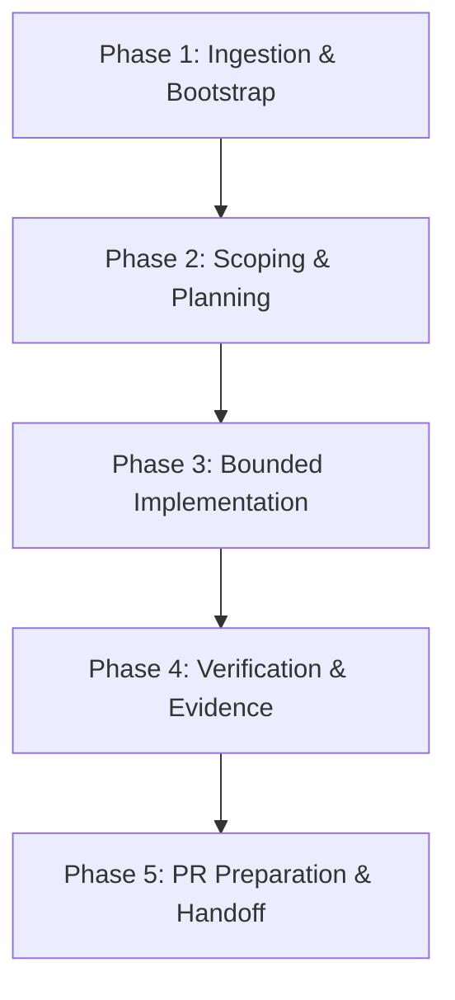

# Agent Workflow & Execution Guide

Status: normative agent operational guide
Repository: `skulmakov-oss/Semantic`

This document defines the standard execution methodology for AI agents and human contributors in the Semantic repository. It establishes how agents discover context, plan tasks, enforce constraints, execute changes, and gather verification evidence.

---

## 1. Governance & Authority Hierarchy

Every agent operation is bounded by a strict hierarchy of authority:

```text
1. Platform / Safety Constraints
   ↓
2. AGENTS.md (Canonical Bootstrap & Router)
   ↓
3. CONSTRAINTS.md (Repository Invariants)
   ↓
4. .harness/current.task.yaml (Task Authorization Envelope)
   ↓
5. Relevant Semantic Skill / Issue Specification
   ↓
6. Agent Implementation Plan
```

- **Strictness Rule**: A lower layer in this hierarchy may make restrictions stricter, but may never loosen or waive an upper-layer rule.
- **Effective Authority**:
  $$\text{Effective Authority} = \text{Repository Invariants} \cap \text{Task Authority}$$
- **Blocked-by-Constraint Protocol**: If an instruction or situation conflicts with a constraint:
  1. **STOP immediately**.
  2. **Report**: Name the constraint, the blocker, the observed evidence, and the minimum repository owner decision required.
  3. **NEVER bypass** or improvise a workaround.

---

## 2. Core Repository Crate Ownership

Agents must respect explicit crate ownership boundaries:

- **`sm-front`**: Frontend / parser / AST / lexer / source syntax errors.
- **`sm-sema`**: Semantic analysis / type inference and checking / compile-time diagnostics.
- **`sm-ir`**: Intermediate Representation (IR) data structures and lowering passes.
- **`sm-format`**: Canonical SemCode binary format, opcode definitions, and decoding contracts.
- **`sm-emit`**: Emission facade over the `sm-format` binary contract.
- **`sm-verify`**: Verifier admission gate (structure, layout, capability tags, and bytecode validation).
- **`sm-runtime-core`**: Shared runtime vocabulary, execution errors, and quotas.
- **`sm-vm`**: Deterministic execution engine for verifier-admitted SemCode.
- **`smc-cli`**: Canonical public CLI interface and command dispatch.
- **`prom-*`**: Host ABI, capability checks, gate descriptors, runtime sessions, rules, and deterministic audit records.
- **`prom-ui*`**: Platform-neutral UI orchestration, presentation models, and backend event bridges.

---

## 3. Required Agent Toolstack

### A. Codebase Memory MCP (Code Discovery & Navigation)
**Mandatory for repository and source code understanding.**

- **Disciplined Ingestion**:
  - Call `list_projects` only when the exact project key is not already known for the current task/session.
  - Obtain `get_architecture` once per task, and refresh only when structural changes justify it.
  - Do not make ritualistic repeated discovery calls on every turn.
- **Targeted Symbol & Path Queries**:
  - `search_graph(name_pattern, label, file_pattern)` — structured search for types, functions, and modules.
  - `trace_call_path(function_name, direction, depth)` — call chain analysis.
  - `get_code_snippet(qualified_name)` — retrieve symbol source code.
  - `detect_changes(project)` — map diff impact to affected symbols.
- **Blocker Protocol**: If Codebase Memory MCP is unavailable, do not silently substitute an inferior path when marked mandatory; report the blocker and request an owner decision.

### B. mcp-local-rag (Documentation, Research & Historical Context)
**Mandatory for documentation queries, specs, historical decision logs, and research.**

- **Scope**: Use for specifications, historical decisions, architecture reports, and external references. Do not use as a secondary source-code index by default.
- **Evidence Rule**: RAG output is retrieval evidence, not authority. Agents must identify source, status, and reconcile against current code and specs before relying on it.
- **Key Tools**:
  - `query_documents(query)` — query indexed docs and reports.
  - `status()` — inspect indexing coverage.

### C. obra/superpowers (Primary Execution Methodology)
When available, Superpowers owns the primary planning, TDD, debugging, and verification workflow. Superpowers operates **inside** Semantic governance and Harness authority, never above them.

- **`using-superpowers`**: Invoke applicable skills before taking action or asking questions.
- **`brainstorming`**: Explore requirements, alternatives, and architecture before implementation.
- **`writing-plans` / `executing-plans`**: Formulate clear step-by-step plans with explicit review checkpoints.
- **`test-driven-development`**: Write positive and negative test cases before implementation code.
- **`systematic-debugging`**: Perform disciplined root-cause analysis on failures before proposing fixes.
- **`verification-before-completion`**: Confirm evidence from fresh command runs before asserting completion.

### D. Selected Agent Skills Routing
- **`CONSTRAINTS.md`**: Always authoritative across every step (does not require ritual skill invocation for simple edits).
- **`source-driven-development`**: Use whenever verifying current source behavior, API contracts, or external dependencies.
- **`doubt-driven-development`**: Mandatory for Critical (R3) and selected Boundary (R2) changes; challenge assumptions, probe failure modes, and demand fresh proof.
- **`semantic`**: Enforces domain-specific rules for Semantic crates, SemCode formats, verifier admission, VM execution, and PROMETHEUS boundaries.

### E. Conditional Agent Skills
- **`api-and-interface-design`**: Required for public API, ABI, or crate interface changes.
- **`security-and-hardening`**: Required for capability, sanitization, quota, or boundary modifications.
- **`code-review-and-quality`**: Required during pre-PR diff hygiene, clippy analysis, and quality validation.

### F. Tooling Restrictions
- **RuFlo**: Retired and forbidden. Do not invoke or rely on RuFlo tools.
- **Ponytail**: Deferred/experimental. Must remain disabled by default.

---

## 4. Risk Classification Model

Every change in the repository must be classified by its risk tier:

| Tier | Scope | Description | Verification Required |
|---|---|---|---|
| **R0** | Informational | Typos, comments, non-normative documentation | Formatting check, git diff check |
| **R1** | Private | Internal crate refactoring, private module bugfixes | PR-ready gate (`admission_guard.ps1 -PRReady`), unit tests |
| **R2** | Boundary | Parser, public APIs, type rules, IR, serialization format, cross-crate contracts | CI parity gate (`-CIParity`), public API contract tests (`public_api_contracts`), golden test fixtures |
| **R3** | Critical | Verifier admission, SemCode binary format, VM execution, capability gates, PROMETHEUS runtime, determinism, security, release compatibility | Fresh-context adversarial doubt review, full preflight check (`-FullPreflight`), comprehensive regression suite, release bundle verification |

---

## 5. The 5-Phase Agent Lifecycle



### Phase 1: Ingestion & Bootstrap
1. Read [`.harness/current.task.yaml`](../../.harness/current.task.yaml) to verify the active task ID, scope boundaries, and authorizations.
2. Read [`CONSTRAINTS.md`](../../CONSTRAINTS.md) to confirm all non-negotiable invariants.
3. Discover code architecture via Codebase Memory MCP (`get_architecture`).
4. Retrieve relevant documentation and specs via `mcp-local-rag`.

### Phase 2: Scoping & Planning
1. Run brainstorming to clarify requirements, non-goals, and boundary constraints.
2. Verify that planned file touches fall strictly within `allowed_paths` and do not touch `forbidden_paths`.
3. Create an `implementation_plan.md` artifact detailing proposed changes, components, and verification plans.
4. Stop and request review where required by planning mode.

### Phase 3: Bounded Implementation
1. Execute changes using small, auditable patches.
2. Adhere strictly to owner crate boundaries (e.g., `sm-format` owns binary format, `sm-verify` owns admission, `sm-vm` owns deterministic execution).
3. Do not add external dependencies without explicit architectural justification.
4. Do not touch files in `forbidden_paths`.
5. Maintain fail-closed handling and explicit error codes throughout.

### Phase 4: Verification & Evidence Collection
1. Select verification tier based on change risk (R0 through R3) per [`docs/agents/VERIFICATION.md`](VERIFICATION.md).
2. Run `pwsh -File scripts/harness-check.ps1` before committing to confirm uncommitted changes match the task envelope.
3. Run `pwsh -File scripts/workspace_fmt_check.ps1` to verify formatting across workspace packages.
4. Run `cargo clippy --workspace --all-targets -- -D warnings`.
5. Run targeted tests and boundary checks (`cargo test --test legacy_guards`, `cargo test --test public_api_contracts`).
6. Run relevant Admission Guard gates (`pwsh -File scripts/admission_guard.ps1 -PRReady` or `-CIParity`).
7. Capture exact exit codes and output logs as evidence.

### Phase 5: PR Preparation & Handoff
1. Verify the committed scope against the base branch:
   ```powershell
   git diff --name-only origin/main...HEAD
   ```
   Confirm that every changed file is explicitly authorized.
2. Inspect `git diff --check` and `git status` for clean working tree and no unintended changes.
3. Prepare closeout report containing:
   - Files changed (exact inventory).
   - Exact verification commands and results.
   - Any remaining risks or unresolved questions.
   - Confirmation that no compiler/runtime/dependency/workflow behavior was inadvertently altered.
4. Do not auto-merge. Open PR and stop for review.

---

## 6. Harness Contract Specification

The Harness is the per-task capability and authorization envelope stored at `.harness/current.task.yaml`. It prevents agent drift, unauthorized file modifications, and capability escalation.

### Schema Structure

```yaml
task:
  id: <TASK-ID>                     # Stable task identifier (e.g., AGENT-INFRA-01)
  title: "<task description>"       # Descriptive task title
  type: <task_type_identifier>      # Classification of task
  mode: active | closed             # Task lifecycle state
  supersedes: <PREV-TASK-ID>        # Predecessor task if applicable
  authorized_by: "<reference>"      # GitHub issue or direct instruction authority

intent:
  summary: "<summary of goal>"      # Concrete goal and boundary definition

scope:
  allowed_paths:                    # Whitelist of glob patterns agent may touch
    - .harness/current.task.yaml
    - AGENTS.md
    - ...
  forbidden_paths:                  # Blacklist of glob patterns agent must never touch
    - .github/**
    - ...

authorization:
  rust_implementation: bool         # Allowed to write Rust production code
  language_implementation: bool     # Allowed to modify language syntax/semantics
  documentation_addition: bool      # Allowed to create new docs
  documentation_correction: bool    # Allowed to edit existing docs
  test_addition: bool               # Allowed to add tests
  workflow_changes: bool            # Allowed to modify CI/GitHub workflows
  dependency_changes: bool          # Allowed to alter Cargo.toml dependencies
  github_issue_lifecycle: bool      # Allowed to open/close/comment on issues
  git_commit_push_pr: bool          # Allowed to commit and push PRs
  merge_after_review_and_checks: bool # Allowed to merge PRs after review
  stable_promotion: bool            # Allowed to promote features to stable

constraints:
  issue: <issue_number>
  base_branch: <branch_name>
  one_logical_change_per_pr: true
  evidence_before_claims: true
  current_main_is_not_stable: true
  ...
```

### Pre-Commit vs Post-Commit Enforcement
- **Pre-Commit**: `scripts/harness-check.ps1` evaluates `git diff --name-only` (uncommitted / staged working tree) against `allowed_paths` and `forbidden_paths`. It must be run while changes are in the working tree or index.
- **Post-Commit / PR Scope**: Agents must execute `git diff --name-only origin/main...HEAD` to verify that all committed files in the PR branch remain within the authorized scope.
