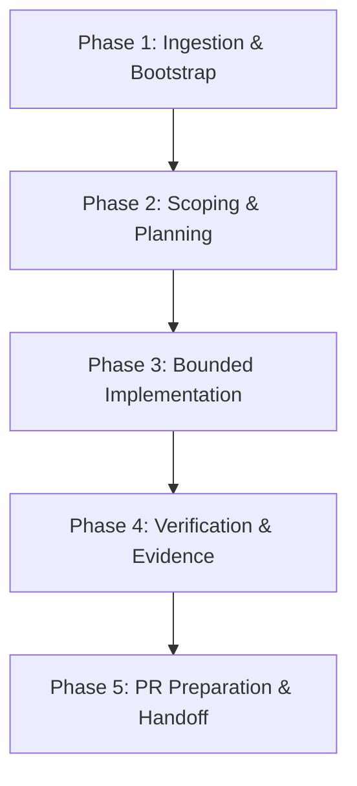

# Agent Workflow & Execution Guide

Status: normative agent operational guide
Repository: `skulmakov-oss/Semantic`

This document defines the standard execution methodology for AI agents and human contributors in the Semantic repository. It establishes how agents discover context, plan tasks, enforce constraints, execute changes, and gather verification evidence.

---

## 1. Governance & Authority Hierarchy

Every agent operation is bounded by a strict hierarchy of authority:

```text
1. Platform / Safety Constraints
   ↓
2. AGENTS.md (Canonical Bootstrap & Router)
   ↓
3. CONSTRAINTS.md (Repository Invariants)
   ↓
4. Explicit Repository-Owner Governance Authorization
   (only for controlled governance-envelope transitions)
   ↓
5. .harness/current.task.yaml (Normal Task Authorization Envelope)
   ↓
6. Normative Specs / Issue Authority
   ↓
7. Repository-Native Semantic Skill
   ↓
8. Agent Implementation Plan
```

- **Strictness Rule**: A lower layer in this hierarchy may make restrictions stricter, but may never loosen or waive an upper-layer rule.
- **Effective Authority**:
  $$\text{Effective Authority} = \text{Repository Invariants} \cap \text{Task Authority}$$
- **Blocked-by-Constraint Protocol**: If an instruction or situation conflicts with a constraint:
  1. **STOP immediately**.
  2. **Report**: Name the constraint, the blocker, the observed evidence, and the minimum repository owner decision required.
  3. **NEVER bypass** or improvise a workaround.

Repository-native skills are domain guards, not independent architectural authorities. If a skill conflicts with `CONSTRAINTS.md`, the active Harness envelope, normative `docs/spec/*`, or verified current repository evidence, stop and report the drift rather than silently preferring one source.

### Governance-Maintenance Transition

The active Harness envelope governs normal work. If the task itself changes agent governance/Harness files that the normal envelope does not authorize:

1. require explicit repository-owner authorization for a named governance task;
2. record that authority durably in the issue/PR or equivalent task evidence;
3. use a dedicated branch and a narrowly scoped temporary governance envelope for the authorized governance paths;
4. never broaden the envelope merely to make an unrelated edit pass;
5. preserve the transition in branch/PR history;
6. restore the normal main-development envelope before merge when the governance task is intentionally out-of-band from that development track.

This transition authorizes changing the envelope; it does not waive `CONSTRAINTS.md` or platform/safety rules.

---

## 2. Core Repository Crate Ownership

Agents must respect explicit crate ownership boundaries:

- **Deterministic Semantic Core Libraries**:
  - **`sm-front`**: Frontend / parser / AST / lexer / source syntax errors.
  - **`sm-sema`**: Semantic analysis / type inference and checking / compile-time diagnostics.
  - **`sm-ir`**: Intermediate Representation (IR) data structures, lowering passes, and optimizer logic (baseline format owner in historical `docs/spec/*`).
  - **`sm-format`**: Crate containing SemCode binary format definitions, opcode tables, and decoding implementation (spec synchronization tracked for #1846).
  - **`sm-emit`**: Emission facade over the `sm-format` binary contract.
  - **`sm-verify`**: Verifier admission gate (structure, layout, capability tags, and bytecode validation).
  - **`sm-runtime-core`**: Shared runtime vocabulary, execution errors, and quotas.
  - **`sm-vm`**: Deterministic execution engine. Canonical trusted execution is verifier-admitted; explicitly documented raw/diagnostic APIs remain outside that trusted route.
- **Host-Facing Adapters & Platform Boundaries**:
  - **`smc-cli`**: Canonical public CLI interface and command dispatch. Performs authorized host I/O (file read/write for artifacts, terminal printing) but cannot own language semantics or verifier policy.
  - **`prom-*`**: Host ABI, capability checks, gate descriptors, runtime sessions, rules, and deterministic audit records.
  - **`prom-ui*`**: Platform-neutral UI orchestration, presentation models, and backend event bridges.

### Trusted vs Raw VM Execution

Canonical production/trusted execution must enter through verifier-admitted SemCode / verified-token paths. Explicitly documented raw `run_semcode*`-style and diagnostic/compatibility APIs may remain unverified only inside their narrow non-canonical perimeter. Do not migrate those raw APIs into production/trusted call paths and do not describe them as verifier-admitted execution.

---

## 3. Required Agent Toolstack

### A. Codebase Memory MCP (Code Discovery & Navigation)
**Mandatory for repository and source code understanding.**

- **Disciplined Ingestion**:
  - Call `list_projects` only when the exact project key is not already known for the current task/session.
  - Obtain `get_architecture` once per task, and refresh only when structural changes justify it.
  - Do not make ritualistic repeated discovery calls on every turn.
- **Targeted Symbol & Path Queries**:
  - `search_graph(name_pattern, label, file_pattern)` — structured search for types, functions, and modules.
  - `trace_call_path(function_name, direction, depth)` — call chain analysis.
  - `get_code_snippet(qualified_name)` — retrieve symbol source code.
  - `detect_changes(project)` — map diff impact to affected symbols.
- **No Autonomous Fallback**: If Codebase Memory MCP is unavailable, agents must not silently or autonomously substitute alternative discovery mechanisms. The agent system is deterministic and fail-closed:
  $$\text{required capability unavailable} \rightarrow \text{STOP} \rightarrow \text{report exact blocker} \rightarrow \text{owner decides}$$
  Only the repository owner/user may authorize a task-scoped, visible, and temporary fallback when necessary. Historical sessions without MCP tools do not establish autonomous fallback authority. The absence of an existing compliant solution is not permission to weaken a constraint.

### B. mcp-local-rag (Documentation, Research & Historical Context)
**Mandatory for documentation queries, specs, historical decision logs, and research.**

- **Scope**: Use for specifications, historical decisions, architecture reports, and external references. Do not use as a secondary source-code index by default.
- **Evidence Rule**: RAG output is retrieval evidence, not authority. Agents must identify source, status, and reconcile against current code and specs before relying on it.
- **Key Tools**:
  - `query_documents(query)` — query indexed docs and reports.
  - `status()` — inspect indexing coverage.

### C. obra/superpowers (Primary Execution Methodology)
When available, Superpowers owns the primary planning, TDD, debugging, and verification workflow. Superpowers operates **inside** Semantic governance and Harness authority, never above them.

- **`using-superpowers`**: Invoke applicable skills before taking action or asking questions.
- **`brainstorming`**: Explore requirements, alternatives, and architecture before implementation.
- **`writing-plans` / `executing-plans`**: Formulate clear step-by-step plans with explicit review checkpoints.
- **`test-driven-development`**: Write positive and negative test cases before implementation code.
- **`systematic-debugging`**: Perform disciplined root-cause analysis on failures before proposing fixes.
- **`verification-before-completion`**: Confirm evidence from fresh command runs before asserting completion.

### D. External Agent Skills Routing
External process skills answer **how to work**. They do not own Semantic architecture, language contracts, verifier policy, or runtime semantics.

- **`CONSTRAINTS.md`**: Always authoritative across every step (does not require ritual skill invocation for simple edits).
- **`source-driven-development`**: Use whenever verifying current source behavior, API contracts, or external dependencies.
- **`doubt-driven-development`**: Mandatory for Critical (R3) and selected Boundary (R2) changes; challenge assumptions, probe failure modes, and demand fresh proof.

### E. Repository-Native Semantic Skills
Repository-native skills answer **what Semantic permits in the affected domain**.

- **`semantic`** (`.agents/skills/semantic/SKILL.md`) — primary Semantic domain router and subsystem architecture dispatcher.
- **`semantic-source-authoring-guard`** (`.agents/skills/semantic-source-authoring-guard/SKILL.md`) — **mandatory whenever a task creates or modifies Semantic `.sm` source, fixtures, examples, or negative diagnostic probes.**
- **`semantic-verifier-runtime-guard`** (`.agents/skills/semantic-verifier-runtime-guard/SKILL.md`) — **mandatory for SemCode format, verifier admission, deterministic VM execution, runtime quotas, capabilities, and PROMETHEUS host/effect boundaries.**
- **`semantic-contract-release-guard`** (`.agents/skills/semantic-contract-release-guard/SKILL.md`) — **mandatory for public API/ABI contracts, binary serialization formats, spec synchronization, and release/status honesty.**
- **`semantic-ui-boundary-guard`** (`.agents/skills/semantic-ui-boundary-guard/SKILL.md`) — **mandatory for UI orchestration, presentation models, interaction semantics, trace/audit projections, and native backend facades.**

Do not use repository-native skills as a replacement for Harness authorization or normative specs. Do not silently choose fixture/test behavior over a conflicting normative spec; treat `spec ↔ executable evidence` disagreement as contract drift and stop/report when it cannot be safely reconciled.

### F. Conditional Agent Skills
- **`api-and-interface-design`**: Required for public API, ABI, or crate interface changes.
- **`security-and-hardening`**: Required for capability, sanitization, quota, or boundary modifications.
- **`code-review-and-quality`**: Required during pre-PR diff hygiene, clippy analysis, and quality validation.

### G. Tooling Restrictions
- **RuFlo**: Retired and forbidden. Do not invoke or rely on RuFlo tools.
- **Ponytail**: Deferred/experimental. Must remain disabled by default.

---

## 4. Risk Classification Model

Every change in the repository must be classified by its risk tier:

| Tier | Scope | Description | Verification Required |
|---|---|---|---|
| **R0** | Informational | Typos, comments, non-normative documentation | Formatting check, git diff check |
| **R1** | Private | Internal crate refactoring, private module bugfixes | PR-ready gate (`admission_guard.ps1 -PRReady`), unit tests |
| **R2** | Boundary | Parser, public APIs, type rules, IR, serialization format, cross-crate contracts | CI parity gate (`-CIParity`), public API contract tests (`public_api_contracts`), golden test fixtures |
| **R3** | Critical | Verifier admission, SemCode binary format, VM execution, capability gates, PROMETHEUS runtime, determinism, security, release compatibility | Fresh-context adversarial doubt review, full preflight check (`-FullPreflight`), comprehensive regression suite, release bundle verification |

---

## 5. The 5-Phase Agent Lifecycle



### Phase 1: Ingestion & Bootstrap
1. Read [`.harness/current.task.yaml`](../../.harness/current.task.yaml) to verify the normal active task ID, scope boundaries, and authorizations.
2. Read [`CONSTRAINTS.md`](../../CONSTRAINTS.md) to confirm all non-negotiable invariants and determine whether a controlled governance-maintenance transition is required.
3. Discover code architecture via Codebase Memory MCP (`get_architecture`).
4. Retrieve relevant documentation and specs via `mcp-local-rag`.
5. Route to the applicable repository-native Semantic skill(s): use `semantic` for general Semantic domain work and additionally require `semantic-source-authoring-guard` for any `.sm` source/fixture/example/diagnostic-probe authoring.

### Phase 2: Scoping & Planning
1. Run brainstorming to clarify requirements, non-goals, and boundary constraints.
2. Formulate an implementation plan. **By default, planning is a logical / non-repository artifact** (e.g. in-session representation, memory, or external agent scratch storage). A repository-local plan file (such as `implementation_plan.md`) may be created **only** when its specific path is explicitly authorized by the active task envelope (`allowed_paths`).
3. Verify that all planned file touches fall strictly within `allowed_paths` and do not touch `forbidden_paths`, or complete the controlled governance-maintenance transition before editing governance files.
4. Stop and request review where required by planning mode.

### Phase 3: Bounded Implementation
1. Execute changes using small, auditable patches.
2. Adhere strictly to owner crate boundaries and normative specifications (e.g., `docs/spec/quad_logic_frame_v1.md` for Quad logic; `sm-format` for SemCode binary format implementation, with formal spec synchronization bounded for #1846).
3. Preserve canonical trusted execution through verifier-admitted routes. Do not convert raw/diagnostic VM APIs into production/trusted execution shortcuts.
4. Do not add external dependencies without explicit architectural justification.
5. Do not touch files in `forbidden_paths`.
6. Maintain fail-closed handling and explicit error codes throughout. Ensure deterministic core libraries do not introduce direct host side effects.

### Phase 4: Verification & Evidence Collection
1. Select verification tier based on change risk (R0 through R3) per [`docs/agents/VERIFICATION.md`](VERIFICATION.md).
2. Inspect untracked files with:
   ```powershell
   git ls-files --others --exclude-standard
   ```
   The current `scripts/harness-check.ps1` does not see untracked files.
3. Stage intended new files before Harness verification so they are visible to the staged-path check.
4. Run `pwsh -File scripts/harness-check.ps1` before committing to validate staged/tracked changes against the task envelope.
5. Run the formatting/lint/test commands required by the selected risk profile.
6. Capture exact exit codes and output logs as evidence.
7. **Context Economy Checkpoint (When Triggered)**: On major phase completion or before context handoff, summarize durable facts, verification results, and owner decisions into a validated checkpoint per [`docs/agents/CONTEXT.md`](CONTEXT.md). Evict raw test/tool output only after structured extraction.

### Phase 5: PR Preparation & Handoff
1. Verify the committed scope against the base branch:
   ```powershell
   git diff --name-only origin/main...HEAD
   ```
   Confirm that every changed file is explicitly authorized by the normal envelope or by the recorded controlled governance transition.
2. Inspect `git diff --check` and `git status` for clean working tree and no unintended changes.
3. Validate checkpoint state (if used) with `pwsh -File scripts/context_checkpoint_check.ps1 -Checkpoint <path> -AgainstCurrentRepo`.
4. Submit PR with full verification evidence, risk tier, and stable/release boundary declarations.
5. Prepare closeout report containing:
   - Files changed (exact inventory).
   - Exact verification commands and results.
   - Any remaining risks or unresolved questions.
   - Confirmation that no compiler/runtime/dependency/workflow behavior was inadvertently altered.
6. Do not auto-merge. Open PR and stop for review.

---

## 6. Harness Contract Specification

The Harness is the per-task capability and authorization envelope stored at `.harness/current.task.yaml`. It prevents agent drift, unauthorized file modifications, and capability escalation.

### Schema Structure

```yaml
task:
  id: <TASK-ID>                     # Stable task identifier (e.g., AGENT-INFRA-01)
  title: "<task description>"       # Descriptive task title
  type: <task_type_identifier>      # Classification of task
  mode: active | closed             # Task lifecycle state
  supersedes: <PREV-TASK-ID>        # Predecessor task if applicable
  authorized_by: "<reference>"      # GitHub issue or direct instruction authority

intent:
  summary: "<summary of goal>"      # Concrete goal and boundary definition

scope:
  allowed_paths:                    # Whitelist of glob patterns agent may touch
    - .harness/current.task.yaml
    - AGENTS.md
    - ...
  forbidden_paths:                  # Blacklist of glob patterns agent must never touch
    - .github/**
    - ...

authorization:
  rust_implementation: bool         # Allowed to write Rust production code
  language_implementation: bool     # Allowed to modify language syntax/semantics
  documentation_addition: bool      # Allowed to create new docs
  documentation_correction: bool    # Allowed to edit existing docs
  test_addition: bool               # Allowed to add tests
  workflow_changes: bool            # Allowed to modify CI/GitHub workflows
  dependency_changes: bool          # Allowed to alter Cargo.toml dependencies
  github_issue_lifecycle: bool      # Allowed to open/close/comment on issues
  git_commit_push_pr: bool          # Allowed to commit and push PRs
  merge_after_review_and_checks: bool # Allowed to merge PRs after review
  stable_promotion: bool            # Allowed to promote features to stable

constraints:
  issue: <issue_number>
  base_branch: <branch_name>
  one_logical_change_per_pr: true
  evidence_before_claims: true
  current_main_is_not_stable: true
  ...
```

### Pre-Commit vs Post-Commit Enforcement

- **Untracked preflight**: `git ls-files --others --exclude-standard` must be inspected before the Harness check. New intended files must be staged so they are visible to the current script.
- **Pre-Commit tracked/staged check**: `scripts/harness-check.ps1` evaluates tracked/staged diffs against `allowed_paths` and `forbidden_paths`. Do not claim it covers untracked files.
- **Post-Commit / PR Scope**: execute `git diff --name-only origin/main...HEAD` and verify every committed file against the active/recorded authorization.
- **Governance transition**: if changing governance/Harness files outside the normal envelope, require the controlled repository-owner transition above; never self-authorize by silently widening the envelope.
