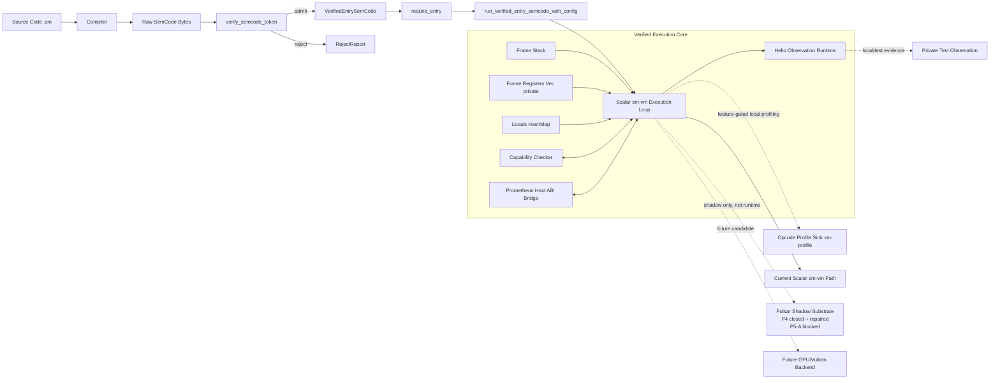

# Semantic VM Verified Execution Core Architecture

## 1. Status

This document describes the current verified execution architecture.

It does not approve new VM behavior, public API widening, Pulsar runtime integration,
GPU/Vulkan backend work, verifier changes, SemCode changes, or P5-A.

- current active execution path: scalar `sm-vm`
- verified execution requires SemCode admission
- public VM API unchanged, except the narrow #1770 correctness hardening below
- production VM behavior unchanged, except the narrow #1770 correctness hardening below
- Pulsar P4 evidence closed and evidence-repaired
- Pulsar P5-A blocked by current profiling evidence
- `#1770` (umbrella #1617): `Frame.regs` was privatized (`pub regs: Vec<Value>` ->
  private `Vec<RegisterSlot>`) and undefined register reads now deterministically
  fail instead of silently reading back a fail-open `Value::Unit`. This is a
  narrow safety-invariant repair, not the kind of new-behavior/API-widening
  scope this document otherwise gates.

## 2. Current verified execution pipeline

The current verified execution pipeline is:

```text
Source Code (.sm)
  -> Compiler
  -> Raw SemCode Bytes
  -> verify_semcode_token
  -> require_entry
  -> VerifiedEntrySemCode
  -> run_verified_entry_semcode_with_config
  -> Execution Loop
```

Raw execution helpers still exist for tests, diagnostics, and malformed-byte
behavior, but they are not the canonical verified path.

## 3. Admission gate

The verifier remains the admission authority.
The VM does not silently execute unverified SemCode through the canonical verified path.

```text
Raw SemCode Bytes
  -> admit: VerifiedEntrySemCode
  -> reject: RejectReport
```

`verify_semcode_token` produces the verifier admission token, and
`require_entry` upgrades that token to a `VerifiedEntrySemCode` for execution.

## 4. Execution core components

| Component | Current implementation meaning | Notes |
|---|---|---|
| Frame Stack | VM call stack | `VM.callstack` |
| Frame Registers | frame-local, private `Vec<RegisterSlot>` (`Uninitialized` or `Value`) | not a hardware register file; undefined reads fail deterministically (#1770) |
| Locals | `HashMap<SymbolId, Value>` | deterministic runtime locals |
| Execution Loop | opcode dispatch loop | scalar `sm-vm` execution |
| Capability Checker | host capability boundary | no authority widening |
| Prometheus Host ABI Bridge | host ABI interaction path | capability-checked |
| Hello Observation Runtime | local observation/event collection path | `sm_runtime_core::hello_observation_sink` and test-only terminal snapshot hooks |
| Opcode Profile Sink | feature-gated `vm-profile` local measurement | not production telemetry |

Relevant current symbols and paths include:

- `crates/sm-vm/src/semcode_vm.rs`
- `crates/sm-verify/src/lib.rs`
- `crates/sm-runtime-core/src/hello_observation_sink.rs`
- `prom_abi::PrometheusHostAbi`
- `prom_cap::CapabilityChecker`

## 5. Local evidence and profiling paths

Local observation and opcode profiling are evidence, test, and developer diagnostics paths.

They do not define production telemetry.
They do not change VM semantics.

Current local evidence surfaces include:

- private test-only terminal snapshot evidence for helper-boundary equivalence;
- `vm-profile` profiling for local opcode measurement.

Both must not be described as production observability.

## 6. Pulsar status

Pulsar is an internal fast packed-state substrate candidate.

P4 shadow equivalence is closed and evidence-repaired.

The `#1237` repair completed:

- CPU feature path diagnostics in `ShadowMismatchReport`;
- enabled Cargo features diagnostics in `ShadowMismatchReport`;
- `QuadroBank::merge_inplace` batch-path coverage;
- `QuadroBank::intersect_inplace` batch-path coverage.

P5-A remains blocked by current profiling evidence.

Pulsar is not an active `sm-vm` runtime backend.
Pulsar is not the VM authority.
Pulsar does not own SemCode, verifier admission, or source semantics.

## 7. Future candidates

Future acceleration candidates may include:

- Pulsar runtime candidate path, only after fresh measured evidence reopens P5-A;
- GPU/Vulkan backend, only as future architecture work;
- scalar `sm-vm` improvements, only through measured VM evidence.

These are future directions only.

Do not claim:

- Pulsar runtime integration is approved;
- GPU/Vulkan backend exists;
- P5-A is open;
- production performance improved;
- public VM API expanded.

## 8. Execution architecture diagram



## 9. Non-claims

This document does not claim:

- VM performance improved;
- public VM API changed, beyond the narrow #1770 `Frame.regs` privatization noted in Section 1;
- production VM behavior changed, beyond the narrow #1770 undefined-register fail-closed repair noted in Section 1;
- Pulsar is runtime-integrated;
- P5-A is open;
- P5-B is approved;
- GPU/Vulkan backend exists;
- SemCode format changed;
- verifier admission changed;
- PROMETHEUS or CTF boundaries widened.

