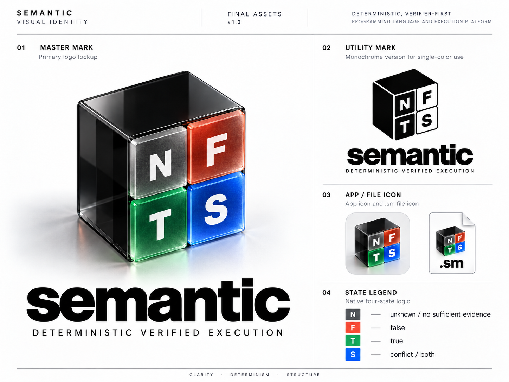

# Semantic visual identity

Current approved identity: **v1.2**.

- [Identity specification and adoption decision](visual_identity_v1_2.md)
- [Architectural and design rationale](brand_rationale.md)
- [Asset usage and offline reproduction](asset_usage.md)
- [Canonical asset family](../../assets/brand/semantic/v1.2/)
- [Approved original visual reference](../../assets/brand/semantic/v1.2/previews/semantic_visual_identity_v1_2.png)

The supplied reference board is preserved byte-for-byte. It contains the
approved acrylic Master Mark, wordmark lockup, utility example, and icon
concepts. Standalone material master artwork and an exact master vector were
not supplied. The reference is canonical artwork; the separate flat SVGs are
canonical utility constructions, not photoreal reconstructions.

The approved reference was supplied directly by the repository owner on
2026-10-06. The adoption decision is recorded in the identity specification.
