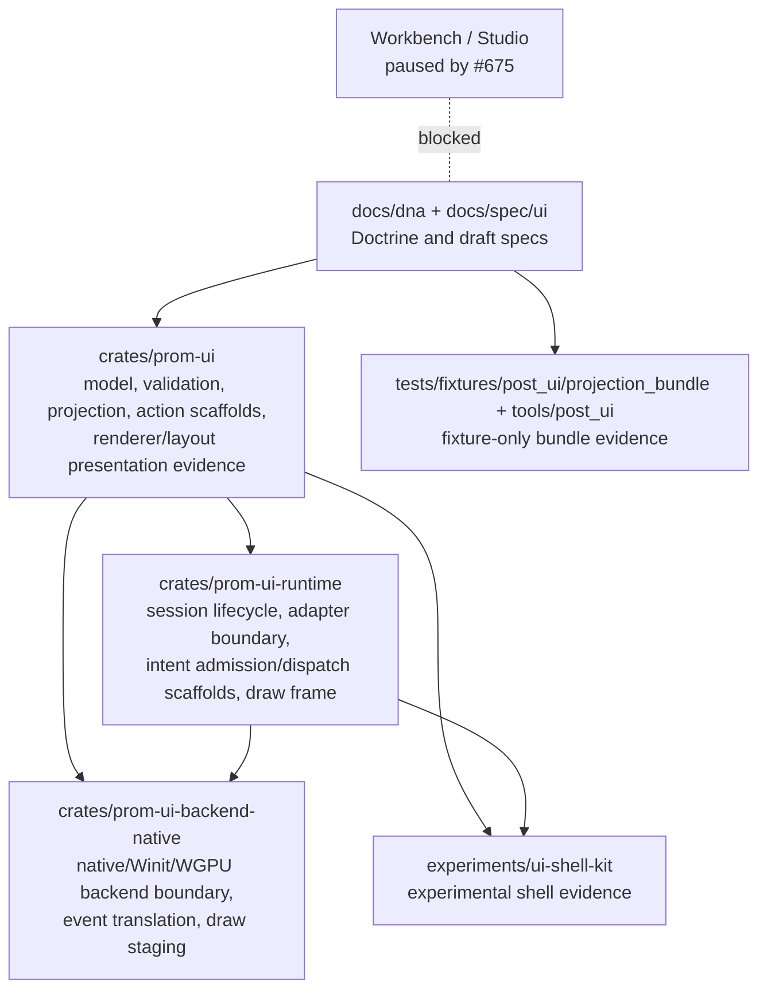

# UI DNA v2 / prom-ui Reconciliation

Status: Evidence baseline for architectural approval
Milestone: UI-DNA2-0
Parent issue: #1488
Implementation roadmap: #1489

This document records repository evidence and recommendations.
It does not authorize implementation.

## 1. Audit Baseline

| Field | Value |
| --- | --- |
| Audit date | 2026-07-10 |
| Repository | `skulmakov-oss/Semantic` |
| Working directory | `C:\Users\said3\Desktop\EXOcode\Semantic_phase1_prom_ui` |
| Branch | `main` |
| HEAD | `928d260fdcf18afdac54636badeaeca56e376610` |
| Tracked modifications at start | `.harness/current.task.yaml` only, approved harness activation for `UI-DNA2-0A` |
| Staging state | empty |
| Untracked-file posture | existing unrelated untracked files preserved; not inspected as source evidence |
| Rust version | `rustc 1.96.1 (31fca3adb 2026-06-26)` |
| Cargo version | `cargo 1.96.1 (356927216 2026-06-26)` |
| Operating environment | `Microsoft Windows NT 10.0.26300.0` |
| Codebase Memory MCP availability | unavailable in this Codex session; no `mcp_codebase-memo_*` tools were exposed |
| Codebase Memory decision | `AGENTS.md` says Codebase Memory MCP is mandatory-first, but does not state that work must not proceed without exposed tools or that fallback is forbidden; local read-only discovery was used |
| Scope inspected | `docs/dna`, `docs/spec/ui`, `docs/roadmap/post_ui`, `crates/prom-ui`, `crates/prom-ui-runtime`, `crates/prom-ui-backend-native`, `experiments/ui-shell-kit`, `tests/fixtures/post_ui/projection_bundle`, `tools/post_ui`, package dependency direction, related GitHub issues |
| Inspection limitations | Codebase Memory graph unavailable; evidence is local file/search/metadata based plus read-only `gh issue view`; no implementation files were changed |

## 2. Executive Conclusion

The current `prom-ui` family is broadly reusable as evidence and as a partial substrate, but it is not already the canonical UI DNA v2 implementation.

Substantially present layers:

- Structural UI model handles: `UiTree`, `UiAst`, `UiIr`, stable local IDs, validation, tree-to-AST and AST-to-IR lowering seeds in `crates/prom-ui/src/model.rs`, `validation.rs`, `tree_bridge.rs`, and `lowering.rs`.
- Projection artifact seed: `UiProjectionArtifact`, projected nodes, deterministic IR-to-projection helper, and source-IR traceability in `crates/prom-ui/src/projection.rs`.
- Local interaction/action scaffolds: raw event normalization, hit testing, action binding, action admission descriptors, denial traces, dispatch traces, and runtime intent admission/dispatch surfaces across `crates/prom-ui/src/*action*`, `raw_event.rs`, `hit_test.rs`, and `crates/prom-ui-runtime/src/intent_*`.
- Runtime/backend substrate: desktop session lifecycle, in-memory backend, draw commands, adapter boundary, native backend, Winit/WGPU feature boundaries in `prom-ui-runtime` and `prom-ui-backend-native`.
- Experimental shell evidence: `experiments/ui-shell-kit` exposes calculator scene/controller, local event/focus/action primitives, draw snapshots, and tests.

Partial layers:

- Static UI IR is present only as an inert, local structural model. It lacks the v2 document shape, role dictionary, bindings, action refs, accessibility contract, source refs, deterministic serialization, versioning, and digest policy required by `docs/spec/ui/ui_ir_schema.md`.
- Action routing exists as first-wave scaffolding but not as the v2 `Action IR` plus `ActionIntent` envelope with actor/session/client refs, source revisions, idempotency, freshness, and ActionOffer references.
- ProjectionBundle has fixture and reader-draft evidence only. `docs/spec/ui/projection_bundle_basis.md` explicitly says there is no parser, loader, runtime, verification authority, or production UI wiring.

Absent layers:

- `.proj.sm` parser and projection source AST.
- Canonical Binding Graph implementation.
- v2 patch stream implementation and shell patch player.
- `TaskRecord`, `TaskStatePatch`, multi-client freshness runtime, and connectivity state implementation.
- Production ProjectionBundle parser, structural validator, compatibility validator, integrity/signature verifier, loader, and activation gate.

Historical R12/Aldente material is evidence of prior UI tracks and renderer metadata work, not an authority to promote old structures into UI DNA v2. `#1152` remains historical tail unless separately revived.

`ui-shell-kit` is a viable experimental shell substrate under `#1310`, but not a production shell and not a ProjectionBundle player today.

The largest ownership risks are: promoting inert `prom-ui` model names as canonical v2 without adding the required contracts; letting Action IR absorb admission authority; treating ProjectionBundle fixtures as loader/activation evidence; and letting R12 renderer/layout work drive the new v2 ownership map.

## 3. UI DNA v2 Requirement Ledger

| ID | Requirement | Authority source | Required owner | Required evidence |
| --- | --- | --- | --- | --- |
| R01 | Projection source | `docs/spec/ui/projection_source_model.md` | Projection source front-end, proposed owner to approve in UI-DNA2-1 | parser/AST contract, diagnostics, forbidden layout-pollution tests |
| R02 | Static UI IR | `docs/spec/ui/ui_ir_schema.md` | Static UI IR owner, proposed `prom-ui` or new projection model module | versioned document, surfaces, nodes, roles, source refs, serialization tests |
| R03 | Stable node identity | `docs/spec/ui/ui_ir_schema.md` | Static UI IR | stable IDs and keyed collection tests |
| R04 | Role dictionary | `docs/spec/ui/projection_source_model.md`, `ui_ir_schema.md` | Projection/UI IR shared role owner | versioned role dictionary and compatibility tests |
| R05 | Bindings | `docs/spec/ui/ui_ir_schema.md`, `projection_patch_model.md` | Binding Graph | source/target graph, revision, dirty propagation tests |
| R06 | Action references | `docs/spec/ui/ui_ir_schema.md` | Static UI IR + Action IR | ActionOffer refs, role, target node/surface, capability/freshness metadata |
| R07 | Action IR | `docs/spec/ui/action_ir_routing.md` | Action IR owner | route contracts, safe/guarded/danger policy, repeat/idempotency tests |
| R08 | Admission boundary | `docs/spec/ui/action_ir_routing.md`, `SEMANTIC_UI_DNA_v2.md` | Semantic admission/runtime capability boundary | admitted/denied traces; UI cannot admit itself |
| R09 | Patches | `docs/spec/ui/projection_patch_model.md` | Projection patch model | envelope, ordering, stale/duplicate/out-of-order tests |
| R10 | Quad-state preservation | `SEMANTIC_UI_DNA_v2.md`, `ui_ir_schema.md` | Projection/UI IR/patch model | N/F/T/S preservation tests; no bool flattening |
| R11 | Denial | `docs/spec/ui/denial_recovery_projection.md` | Denial projection | LocalDenied vs AdmissionDenied routes and evidence |
| R12 | Recovery | `docs/spec/ui/denial_recovery_projection.md` | Recovery projection | Dismiss/Acknowledge/Retry/Resume/CancelSuffix routes; ResumeToken rules |
| R13 | Task projection | `docs/spec/ui/task_projection_model.md` | Task projection | TaskRecord refs, TaskStatePatch, phases, controls, locks |
| R14 | Freshness | `docs/spec/ui/multi_client_freshness_model.md` | Connectivity/freshness projection | Fresh/Degraded/Stale/Offline/Resyncing/PendingUnknown tests |
| R15 | Connectivity | `docs/spec/ui/multi_client_freshness_model.md` | Connectivity projection | control gating, no offline critical queue evidence |
| R16 | Accessibility | `projection_source_model.md`, `ui_ir_schema.md` | Projection/UI IR/shell | role labels, focus intent, non-visual interpretation |
| R17 | ProjectionBundle | `docs/spec/ui/projection_bundle_delivery.md` | Bundle package owner | manifest, artifacts, role dictionary, renderer profile |
| R18 | Bundle parsing | `projection_bundle_delivery.md`, `projection_bundle_basis.md` | Bundle parser | parser tests beyond fixture reader |
| R19 | Structural validation | `projection_bundle_delivery.md` | Bundle validator | valid/invalid structural bundle tests |
| R20 | Compatibility validation | `projection_bundle_delivery.md` | Bundle compatibility validator | role/renderer/profile compatibility matrix |
| R21 | Integrity verification | `projection_bundle_delivery.md` | Bundle trust verifier | hash/signature validation and rejection tests |
| R22 | Loading | `projection_bundle_delivery.md` | Bundle loader | inert loader, no activation side effects |
| R23 | Activation | `projection_bundle_delivery.md` | Activation gate | verification-before-activation and safe update boundary tests |
| R24 | Shell interpretation | `SEMANTIC_UI_DNA_v2.md`, `ui_shell_kit_projection_alignment.md` | Shell player | patch/bundle interpretation evidence without semantic authority |
| R25 | Renderer boundary | `SEMANTIC_UI_DNA_v2.md`, runtime/backend specs | Renderer/backend owner | renderer consumes draw/presentation, does not own meaning |
| R26 | Deterministic serialization | `ui_ir_schema.md`, `projection_bundle_delivery.md` | UI IR/bundle owners | canonical serialization and digest stability tests |
| R27 | Deterministic snapshots | `ui_shell_kit_projection_alignment.md`, draw snapshot policy | Shell/evidence owner | snapshot/golden fixtures and replay stability |

## 4. Current Repository Inventory

| ID | Current entity | Path/module | Current owner | Public/internal | Responsibility | Evidence |
| --- | --- | --- | --- | --- | --- | --- |
| E01 | UI doctrine v2 | `docs/dna/SEMANTIC_UI_DNA_v2.md` | docs/dna | public doctrine | Meaning -> intent -> UI IR -> rendering doctrine | issue #1327 closed/completed |
| E02 | Projection source spec | `docs/spec/ui/projection_source_model.md` | docs/spec/ui | draft spec | `.proj.sm` posture, allowed/forbidden intent | explicitly says no parser grammar implementation |
| E03 | UI IR schema spec | `docs/spec/ui/ui_ir_schema.md` | docs/spec/ui | draft spec | target deterministic UI IR shape | explicitly says no Rust types/compiler/runtime |
| E04 | Action IR spec | `docs/spec/ui/action_ir_routing.md` | docs/spec/ui | draft spec | Action IR and future ActionIntent envelope | explicitly says no Action IR/runtime implementation |
| E05 | Patch model spec | `docs/spec/ui/projection_patch_model.md` | docs/spec/ui | draft spec | Binding Graph and patch families | explicitly says no Binding Graph/patch runtime |
| E06 | Denial/recovery spec | `docs/spec/ui/denial_recovery_projection.md` | docs/spec/ui | draft spec | denial/recovery/batch taxonomy | explicitly says no denial/recovery runtime |
| E07 | Task projection spec | `docs/spec/ui/task_projection_model.md` | docs/spec/ui | draft spec | TaskRecord and TaskStatePatch model | explicitly says no task execution/projection runtime |
| E08 | Freshness spec | `docs/spec/ui/multi_client_freshness_model.md` | docs/spec/ui | draft spec | viewer-relative control and freshness | explicitly says no networking/freshness tracking |
| E09 | Bundle delivery spec | `docs/spec/ui/projection_bundle_delivery.md` | docs/spec/ui | draft spec | ProjectionBundle delivery and activation rules | explicitly says no loader/verification/runtime |
| E10 | Bundle basis | `docs/spec/ui/projection_bundle_basis.md` | docs/spec/ui | claim boundary | fixture/draft claim levels | current achieved level is Level 3 baseline; Levels 4-7 not claimed |
| E11 | `UiTree`, `UiAst`, `UiIr` | `crates/prom-ui/src/model.rs` | `prom-ui` | public exports | inert structural handles and containers | module rustdoc says no render/admission/parser/verifier/VM/runtime |
| E12 | Validation seeds | `crates/prom-ui/src/validation.rs` | `prom-ui` | public exports | tree/AST/IR structural validation | rustdoc says no parse/verify/typecheck/effect admission/render |
| E13 | Tree/AST/IR lowering chain | `tree_bridge.rs`, `lowering.rs`, slot-intent modules | `prom-ui` | public exports | historical model transformation and slot metadata | tests `ui_tree_to_ast_bridge.rs`, `ui_ast_ir_lowering_carriers.rs`, slot-carrier tests |
| E14 | Projection artifact | `crates/prom-ui/src/projection.rs` | `prom-ui` | public exports | validates IR and builds inert projection artifact | `UiProjectionArtifact`, `project_ir_to_projection`, deterministic projection tests |
| E15 | Renderer presentation/model | `crates/prom-ui/src/renderer.rs` | `prom-ui` | public exports | projection-to-render model and renderer presentation metadata | renderer tests and public API lock tests |
| E16 | Layout models | `crates/prom-ui/src/layout/**`, `minimal_block_layout.rs`, `layout_rect.rs` | `prom-ui` | public exports | renderer/local layout evidence | layout seed/golden tests under `crates/prom-ui/tests` |
| E17 | Raw event normalization | `crates/prom-ui/src/raw_event.rs` | `prom-ui` | public exports | raw event to interaction intent descriptor | tests in module and interaction tests |
| E18 | Hit testing | `crates/prom-ui/src/hit_test.rs`, `layout/physical_placement.rs` | `prom-ui` | public exports | local hit-test helper/trait | `ui_hit_test_contract.rs` |
| E19 | Action mapping | `crates/prom-ui/src/action_mapping.rs` | `prom-ui` | public exports | maps interaction to `SemanticIntent`; default inert mapper returns none | `ui_action_mapping_contract.rs` |
| E20 | Action admission descriptor | `crates/prom-ui/src/action_admission.rs`, result/trace modules | `prom-ui` | public exports | descriptor/evidence for admission requirements | descriptor tests; rustdoc says no actual admission/execution |
| E21 | Runtime intent admission | `crates/prom-ui-runtime/src/intent_admission.rs` | `prom-ui-runtime` | public export | evaluates `SemanticIntent` through inert capability/audit scaffolds | `runtime_intent_capability_contract.rs`, `runtime_intent_audit_contract.rs` |
| E22 | Runtime dispatch | `crates/prom-ui-runtime/src/intent_dispatch.rs`, `state_update.rs` | `prom-ui-runtime` | public export | dispatches already admitted action into inert updater | `runtime_intent_dispatch_contract.rs` |
| E23 | Runtime/session/draw | `crates/prom-ui-runtime/src/lib.rs` | `prom-ui-runtime` | public API | desktop session, event buffer, draw commands, in-memory backend | many runtime tests; crate rustdoc calls backend policy internal |
| E24 | Native backend | `crates/prom-ui-backend-native/src/lib.rs`, `action_translation.rs`, `frame_sink.rs`, `draw_generation.rs`, `session_hook.rs` | `prom-ui-backend-native` | public crate API | native event/backend bridge, Winit/WGPU feature paths, draw staging | native backend tests and feature contracts |
| E25 | GPU quad transport | `crates/prom-ui-backend-native/src/quad_tile_upload.rs` | `prom-ui-backend-native` | `wgpu-backend` gated | visual/backend transport ABI | unrelated to UI DNA v2 projection model except renderer/backend boundary evidence |
| E26 | ui-shell-kit | `experiments/ui-shell-kit/src/lib.rs` | experimental crate | public experiment API | calculator shell, event/focus/paint/snapshot primitives | #1310 open; tests for calculator/focus/hit/motion/reference scenario |
| E27 | ProjectionBundle fixtures | `tests/fixtures/post_ui/projection_bundle/**` | test fixtures | fixture-only | inert positive/negative/probe sketches and golden reader output | `projection_bundle_basis.md`, expected reader outputs |
| E28 | ProjectionBundle draft tools | `tools/post_ui/projection_bundle_*_draft.rs`, `check_projection_bundle_*.ps1` | tools/post_ui | tool/fixture-only | manifest draft and fixture-facing sketch reader | basis says not parser/loader/runtime/verification |
| E29 | Dependency direction | `cargo tree` | Cargo workspace | package graph | `prom-ui-runtime -> prom-ui`; `prom-ui-backend-native -> prom-ui + prom-ui-runtime`; `ui-shell-kit -> prom-ui + prom-ui-runtime` | no reverse dependency from `prom-ui` to runtime/backend/shell |

## 5. Main Reconciliation Matrix

| ID | UI DNA2 concern | Current evidence | Classification | Preserved contract | Required change | Target owner | Risk | Decision required | Phase |
| --- | --- | --- | --- | --- | --- | --- | --- | --- | --- |
| M01 | Projection source `.proj.sm` | `projection_source_model.md`; no source parser found | ABSENT | doctrine/spec only | introduce parser/AST/diagnostics after ownership freeze | PROPOSED - projection source front-end | parser could pollute `.sm` or layout | owner and grammar choice | UI-DNA2-2 |
| M02 | Existing `UiAst` as projection source AST | `crates/prom-ui/src/model.rs::UiAst` | ADAPT | local AST handles and node kinds | cannot be canonical projection source AST without grammar/source refs/diagnostics | PROPOSED - projection source or static model owner | name similarity could overclaim | whether to adapt or create separate AST type | UI-DNA2-1/2 |
| M03 | Static UI IR structural core | `UiIr`, `UiIrNode`, `UiIrNodeId` | ADAPT | stable local IDs, parent/child structure, inertness | add v2 document shape, surfaces, roles, bindings, action refs, source refs, versioning, serialization | PROPOSED - `prom-ui` static IR module | current type lacks required contracts | public compatibility policy | UI-DNA2-3 |
| M04 | Role dictionary | only enum vocabularies like `UiIrNodeKind`; role specs in docs | ABSENT | none beyond draft role words | versioned role dictionary with allowed/forbidden interpretation | PROPOSED - role dictionary owner | renderer/widget role confusion | dictionary location and versioning | UI-DNA2-1/3 |
| M05 | Stable node identity | `UiNodeId`, `UiAstNodeId`, `UiIrNodeId`, `UiProjectedNodeId` | REUSE | typed local ID wrappers and public accessors | document relationship to v2 IDs; avoid using raw equality across domains | PROPOSED - model owner keeps ID domains | raw u64 reuse across domains | ID compatibility policy | UI-DNA2-1/3 |
| M06 | Keyed collections | spec requires stable keys; no implementation type found | ABSENT | none | add collection/key model and diagnostics | PROPOSED - Static UI IR + Binding Graph | anonymous lists would break replay | key model approval | UI-DNA2-3/4 |
| M07 | Binding Graph | `projection_patch_model.md`; no `BindingGraph` type found | ABSENT | none | implement deterministic graph with source/target/revision/dirty propagation | PROPOSED - Binding Graph module | mutation/authority leakage | owner and dependency direction | UI-DNA2-4 |
| M08 | Existing binding-like carriers | slot-intent modules and `UiProjectionPropertyRef` | ADAPT | traceable carrier metadata | split historical carrier metadata from canonical read-side Binding Graph | PROPOSED - Binding Graph and compatibility adapters | historical chain could become canonical by accident | migration/compat adapter decision | UI-DNA2-4 |
| M09 | Action IR | spec exists; no `ActionIr` type found | ABSENT | none | introduce compiled action route model | PROPOSED - Action IR module | action routes may absorb admission | owner and envelope shape | UI-DNA2-5 |
| M10 | `SemanticIntent` | `crates/prom-ui/src/action_mapping.rs` | ADAPT | abstract target + action binding ID | expand or replace with v2 `ActionIntent` envelope carrying actor/session/client/source rev/idempotency/freshness | PROPOSED - Action IR/admission seam | existing name lacks required context | compatibility vs new type | UI-DNA2-5 |
| M11 | Runtime intent admission | `RuntimeIntentAdmission::admit_intent` | ADAPT | admission boundary separated from dispatcher | connect to v2 ActionIntent only after approved mapping; preserve capability/audit boundary | `prom-ui-runtime` | UI may bypass admission if route is flattened | admission authority contract | UI-DNA2-5 |
| M12 | Runtime dispatcher | `RuntimeActionDispatcher` | REUSE | dispatch assumes capability evaluation already happened | no v2 authority change; only consume admitted action | `prom-ui-runtime` | low if admission remains separate | no authority expansion | UI-DNA2-5 |
| M13 | Raw event normalization | `RawUiEvent`, `map_raw_event_to_interaction_intent` | ADAPT | raw event stays local and maps to interaction descriptor | add source projection/action context and freshness-aware routing outside raw event type | `prom-ui` / shell boundary | raw events could leak upward | route boundary approval | UI-DNA2-5 |
| M14 | Hit testing/focus routing | `hit_test.rs`, `physical_placement::hit_test_placement`, ui-shell-kit focus tests | ADAPT | local shell targeting evidence | bind to Action IR lookup without semantic mutation | Shell/local interaction owner | shell could own semantic action | Action IR lookup contract | UI-DNA2-5/9 |
| M15 | Patch streams | docs only; no patch types found | ABSENT | none | define patch envelope, stale/duplicate/out-of-order handling | PROPOSED - projection patch model | ad hoc UI state mutation | patch owner | UI-DNA2-6 |
| M16 | Denial/recovery projection | docs; `action_denial_trace`, admission denial result types | ADAPT | denial trace vocabulary and result scaffolds | implement v2 taxonomy/routes/recovery tokens without UI policy invention | PROPOSED - denial projection + admission result seam | LocalDenied vs AdmissionDenied collapse | route ownership | UI-DNA2-7 |
| M17 | Task projection | docs only; no `TaskRecord` implementation found | ABSENT | none | introduce Semantic-owned task refs and projection patches | PROPOSED - task projection owner | UI-local task engine risk | task authority owner | UI-DNA2-7 |
| M18 | Freshness/connectivity | docs and fixture text only; no runtime tracking found | ABSENT | none | introduce freshness state and control gating evidence | PROPOSED - connectivity projection owner | connected/fresh confusion | networking vs projection boundary | UI-DNA2-7 |
| M19 | Accessibility contract | docs; ui-shell-kit accessibility mention; runtime visual/layout tokens | ADAPT | accessibility recognized as projection contract | add v2 accessibility refs/labels/focus intent in IR and shell evidence | Projection/UI IR/shell | treating as renderer polish | minimum contract | UI-DNA2-3/9 |
| M20 | ProjectionBundle manifest fixture | `manifest_minimal.sketch.md`, draft tool constants | REUSE | fixture evidence and negative probes | keep fixture-only until parser phase; do not treat as final serialization | Bundle evidence owner | overclaiming parser/loader | claim level discipline | UI-DNA2-8 |
| M21 | ProjectionBundle fixture reader draft | `projection_bundle_sketch_reader_draft.rs` | ADAPT | narrow deterministic reader evidence | use as parser-test inspiration; not production parser | Bundle parser owner | fixture reader mistaken for parser | parser basis decision | UI-DNA2-8 |
| M22 | Bundle structural validator | no production validator; probe guards only | ABSENT | none | implement validator after parser | Bundle validator | guard scripts mistaken for validation | validation scope | UI-DNA2-8 |
| M23 | Bundle compatibility validator | no implementation found | ABSENT | none | add role/renderer/profile compatibility matrix | Bundle validator | incompatible activation | compatibility owner | UI-DNA2-8 |
| M24 | Bundle integrity/signature verification | fixture trust fields/probes only | ABSENT | none | implement hash/signature verification separately | Bundle trust verifier | hash/signature overclaim | security boundary | UI-DNA2-8 |
| M25 | Bundle loader | basis says no loader | ABSENT | none | introduce inert loader before activation | Bundle loader | loader becomes activation | loader/activation split | UI-DNA2-8 |
| M26 | Bundle activation | basis says no runtime activation | ABSENT | none | activation gate with safe update boundaries | Activation gate | activation bypasses policy | activation authority | UI-DNA2-8 |
| M27 | `ui-shell-kit` shell primitives | experiment crate, #1310, alignment doc | ADAPT | layout/input/focus/paint/snapshot evidence | keep experimental; evaluate as future player seed only | Experimental shell owner | implicit production promotion | promotion gate | UI-DNA2-9 |
| M28 | `prom-ui-runtime` draw/session substrate | runtime crate | ADAPT | backend seam, in-memory backend, draw commands | remain runtime/backend substrate; do not own UI DNA contracts | Runtime owner | runtime-to-model leakage | shell/runtime split | UI-DNA2-9 |
| M29 | Native backend/WGPU transport | backend-native crate | REUSE | backend-specific rendering/transport boundary stays below runtime | no v2 semantic ownership; consume draw/transport only | `prom-ui-backend-native` | renderer/backend claims meaning | boundary wording | UI-DNA2-9/11 |
| M30 | R12 renderer/layout metadata | `docs/roadmap/post_ui/r12_*`, `prom-ui` renderer/layout tests | REPLACE | retain historical compatibility/evidence | do not make R12 chain the v2 authority model | PROPOSED - compatibility adapter only if needed | old architecture drives new contracts | historical policy | UI-DNA2-1 |

## 6. Projection Source Analysis

CURRENT - `docs/spec/ui/projection_source_model.md` defines `.proj.sm` as the preferred v0 working name, forbids inline projection in `.sm`, defines allowed projection intent, and says it does not implement or finalize a parser grammar. No `.proj.sm` parser, projection lexer, projection AST, or compiler entrypoint was found in `crates/`, `tools/`, or `tests/`.

CURRENT - `crates/prom-ui/src/model.rs::UiAst` is an inert AST container with local `UiAstNodeId`, `UiAstNodeKind`, parent/child handles, and no parser/source references. Tests in `ui_model_seed.rs` and `ui_ast_ir_lowering_carriers.rs` prove structural behavior, not projection source language support.

PROPOSED - requires architect approval: keep projection source separate from `UiAst` until UI-DNA2-1 decides whether `UiAst` becomes an adapter/substrate or remains historical foundation evidence. Projection source needs grammar ownership, source refs, role vocabulary validation, layout pollution diagnostics, accessibility declarations, and deterministic diagnostics.

Classification: `.proj.sm` implementation is ABSENT. Existing `UiAst` is ADAPT, not REUSE, for projection-source responsibilities.

## 7. Static UI IR Analysis

CURRENT - `crates/prom-ui/src/model.rs::UiIr` and `UiIrNode` provide inert structural nodes with typed IDs, kinds, parent/child handles, and optional source AST node reference. `validation.rs` provides structural diagnostics for duplicate IDs, missing parent/child targets, self links, and multiple roots. `projection.rs` can validate an IR and project it into `UiProjectionArtifact`.

CURRENT - the implementation lacks the full `docs/spec/ui/ui_ir_schema.md` top-level document shape: `ir_version`, `projection_id`, `source_refs`, `role_dictionary_version`, `surfaces`, `bindings`, `actions`, evidence/denial/recovery routes, task contracts, connectivity policy, accessibility contract, diagnostics, canonical serialization, and digest policy.

PROPOSED - requires architect approval: adapt the existing `UiIr` model only if public compatibility and versioning rules are frozen first. Stable local ID wrappers are REUSE. Static UI IR document semantics are ADAPT/ABSENT depending on row: structural core ADAPT, role dictionary/bindings/accessibility document contracts ABSENT.

## 8. Binding Graph Analysis

CURRENT - `docs/spec/ui/projection_patch_model.md` defines Binding Graph requirements. No implementation type named `BindingGraph`, no source/target graph, no dependency edges, no dirty propagation engine, and no revision/epoch handling type was found.

CURRENT - existing related evidence is carrier metadata and references: slot-intent modules (`tree_slot_intent`, `tree_slot_ast_intent`, `ast_slot_ir_intent`, `ir_slot_projection_intent`, `projection_slot_render_intent`) and projection refs (`UiProjectionPropertyRef`, `UiProjectionActionRef`, `UiProjectionEffectBoundaryRef`, `UiProjectionTraceRef`). These are not read-side state bindings and do not preserve ActionOffer/task/connectivity revisions.

PROPOSED - requires architect approval: Binding Graph should be introduced as its own owner after the static IR owner is frozen. It may adapt carrier identity patterns but must not inherit historical slot-chain authority.

Classification: Binding Graph implementation is ABSENT. Existing carrier metadata is ADAPT.

## 9. Action IR and Admission Analysis

CURRENT ownership:

| Responsibility | Current owner/evidence |
| --- | --- |
| raw UI event normalization | `crates/prom-ui/src/raw_event.rs` maps `RawUiEvent` to `InteractionIntentDescriptor` |
| hit testing | `crates/prom-ui/src/hit_test.rs`, `layout/physical_placement.rs`, `crates/prom-ui/tests/ui_hit_test_contract.rs` |
| focus routing | `experiments/ui-shell-kit/src/focus.rs`, calculator focus/action trace tests |
| Action IR lookup | ABSENT; only `action_binding.rs` and action binding traces exist |
| ActionIntent construction | ABSENT for v2 envelope; existing `SemanticIntent` has target + action binding ID only |
| action admission descriptor | `crates/prom-ui/src/action_admission.rs` describes requirements but does not execute admission |
| runtime admission | `crates/prom-ui-runtime/src/intent_admission.rs::RuntimeIntentAdmission` evaluates `SemanticIntent` through capability/audit scaffolds |
| capability checks | `crates/prom-ui-runtime/src/intent_capability.rs`, `crates/prom-ui/src/ui_capability_*` scaffolds |
| actor/session/client attribution | ABSENT for v2 ActionIntent |
| stale revision handling | ABSENT for v2 ActionIntent |
| denial traces | `crates/prom-ui/src/action_denial_trace.rs` and related admission/result modules |
| idempotency/repeat behavior | ABSENT for v2 GuardedAction/DangerAction requirements |

The current flow is useful but narrower than UI DNA v2:

```text
RawUiEvent
  -> InteractionIntentDescriptor
  -> SemanticIntent (default mapper currently inert)
  -> RuntimeIntentAdmission
  -> InteractionAdmittedSemanticAction
  -> RuntimeActionDispatcher
```

The v2 target flow remains:

```text
Raw UI event
  -> local normalization
  -> hit test / focus routing
  -> Action IR route
  -> ActionIntent
  -> Semantic admission
```

Classification: raw event normalization ADAPT; runtime admission boundary ADAPT; dispatcher REUSE as an admitted-action consumer; Action IR and full ActionIntent envelope ABSENT.

## 10. Patch Model Analysis

CURRENT - `docs/spec/ui/projection_patch_model.md` defines `SemanticStatePatch`, `ProjectionPatch`, `RenderPatch`, `EvidencePatch`, `ActionOfferPatch`, `ConnectivityPatch`, and deferred `TaskStatePatch`. It explicitly says it does not implement Binding Graph, patch streams, runtime patch queues, shell patch player, Rust types, compiler behavior, or renderer backend behavior.

Search did not find implementation types for `SemanticStatePatch`, `ProjectionPatch`, `EvidencePatch`, `ActionOfferPatch`, `TaskStatePatch`, or `ConnectivityPatch` in the inspected crates. Existing `prom-ui-runtime/src/state_update.rs` is a runtime state updater scaffold for admitted actions, not a projection patch player.

Classification: all v2 patch families are ABSENT. Existing render presentation and draw command output are not patch streams.

## 11. ProjectionBundle Analysis

| Responsibility | Current evidence | Current owner | Classification | Notes |
| --- | --- | --- | --- | --- |
| manifest | `tests/fixtures/post_ui/projection_bundle/manifest_minimal.sketch.md`; `tools/post_ui/projection_bundle_manifest_draft.rs` | fixtures/tools | REUSE | fixture evidence only |
| payload representation | fixture sketches and draft constants | fixtures/tools | ADAPT | needs final serialization decision |
| fixture reader | `tools/post_ui/projection_bundle_sketch_reader_draft.rs` | tools/post_ui | ADAPT | narrow fixture reader, not parser |
| parser | `projection_bundle_basis.md` says no parser | none | ABSENT | needs parser basis |
| structural validator | invalid/probe fixtures and guard scripts only | fixtures/tools | ABSENT | guards are not production validator |
| compatibility validator | spec only | none | ABSENT | needs role/renderer compatibility checks |
| integrity verification | trust fields/probes only | none | ABSENT | no hash/signature verifier |
| signature verification | trust fields/probes only | none | ABSENT | no crypto verification |
| loader | basis says no loader | none | ABSENT | must remain separate from parser |
| activation | basis says no runtime activation | none | ABSENT | must remain separate from loader |

`docs/spec/ui/projection_bundle_basis.md` is the controlling evidence boundary. It states current achieved level is Level 3 baseline and that Level 4 general reader/parser behavior, Level 5 loader behavior, Level 6 runtime behavior, and Level 7 production UI behavior are not claimed.

## 12. Shell and Renderer Analysis

CURRENT - `prom-ui` owns structural model, validation, projection, renderer presentation metadata, and layout evidence. It does not own runtime/backend execution. The crate rustdoc says Wave 0 scaffolding, inert markers, and no published stable UI support claim.

CURRENT - `prom-ui-runtime` owns runtime side of the first-wave UI boundary: session lifecycle, input event polling, frame tokens, draw command family, backend adapter contract, in-memory backend, intent admission/dispatch scaffolds. It depends on `prom-ui`, not the reverse.

CURRENT - `prom-ui-backend-native` owns native backend facade, raw backend event capture/translation, frame sink, draw generation, Winit/WGPU feature contracts, and GPU transport. It depends on `prom-ui` and `prom-ui-runtime`.

CURRENT - `experiments/ui-shell-kit` owns experimental calculator shell primitives: controller, scene/layout, local event/focus/action queue, paint frame, snapshots, theme. It depends on `prom-ui` and `prom-ui-runtime`.

Classification: runtime/backend boundaries are REUSE as boundaries; shell-player implementation for UI DNA v2 is ADAPT/ABSENT. `ui-shell-kit` is ADAPT as an experimental substrate and must not be promoted implicitly.

## 13. Denial, Recovery, Task and Freshness Analysis

| Concept | Current implementation evidence | Classification | Notes |
| --- | --- | --- | --- |
| `LocalDenied` | docs only; local denial concepts in action/capability denial traces use different names | ABSENT | do not infer equivalence |
| `AdmissionDenied` | admission result/denial scaffolds exist but not v2 taxonomy | ADAPT | keep boundary distinct |
| `PartialDenied` | docs only | ABSENT | no batch result model found |
| `NotApplied` | docs only | ABSENT | no separate state found |
| `BatchBreak` | docs only | ABSENT | no batch patch model found |
| `Dismiss` | docs only | ABSENT | recovery action not implemented |
| `Acknowledge` | existing action names include `AcknowledgeError`; not v2 recovery contract | ADAPT | similar name is insufficient |
| `Retry` | docs only | ABSENT | no v2 retry proposal |
| `Resume` | docs only | ABSENT | no v2 resume path |
| `CancelSuffix` | docs only | ABSENT | no partial batch suffix model |
| `ResumeToken` | docs only | ABSENT | no token type found |
| `TaskRecord` | docs only | ABSENT | no Semantic-owned task record type found |
| `PendingUnknown` | docs/fixtures text only | ABSENT | no runtime state found |
| `Fresh` | docs/fixtures text only | ABSENT | no freshness runtime found |
| `Degraded` | docs only | ABSENT | no freshness runtime found |
| `Stale` | docs only | ABSENT | no freshness runtime found |
| `Offline` | docs only | ABSENT | no freshness runtime found |
| `Resyncing` | docs only | ABSENT | no freshness runtime found |

Denial/recovery/task/freshness are mostly doctrine/spec today. Existing denial trace scaffolds can be adapted, but v2 semantics should not be inferred from similar names.

## 14. Determinism and Evidence Analysis

CURRENT deterministic evidence:

- `crates/prom-ui/src/projection.rs` has deterministic projection tests such as `test_deterministic_projection` and artifact/node ID policies.
- `crates/prom-ui/tests/ui_layout_golden_rects.rs` records stable layout rectangle signatures and repeated-run stability.
- `crates/prom-ui/tests/ui_render_model_stability.rs` and renderer presentation tests cover deterministic renderer-model evidence.
- `crates/prom-ui-runtime/tests/ui_in_memory_deterministic_replay.rs` covers in-memory runtime replay.
- `experiments/ui-shell-kit/tests/*` covers calculator reference, focus/action trace, hit-test stability, and motion phase evidence.
- `tests/fixtures/post_ui/projection_bundle/expected/*.reader.out.txt` provides golden output for fixture-facing ProjectionBundle reader drafts.
- `tests/public_api_contracts.rs` and crate-specific public API lock tests guard current public surfaces.

Missing deterministic evidence:

- canonical UI IR serialization and digest;
- Binding Graph deterministic construction;
- patch replay and stale/out-of-order/duplicate rejection;
- bundle parser/validator/loader/activation golden tests;
- v2 ActionIntent stale revision/idempotency/repeat tests;
- v2 denial/recovery/task/freshness negative fixtures.

## 15. Current Ownership Map

CURRENT repository state:



This map describes observed repository ownership. It does not describe the approved target architecture.

## 16. Proposed Target Ownership Map

PROPOSED — requires architect approval.

| Target owner | Owned contracts | Allowed dependencies | Forbidden dependencies | Public/internal posture | Migration relationship |
| --- | --- | --- | --- | --- | --- |
| Projection source front-end | `.proj.sm` tokens/AST/source refs/diagnostics | docs/spec, future role dictionary | runtime/backend/shell/renderer | internal until grammar approved | may adapt `UiAst` patterns, not inherit current AST as-is |
| Static UI IR owner | versioned IR document, surfaces, nodes, roles, action refs, accessibility refs | projection source AST, role dictionary | runtime/backend/admission/renderer authority | public only after compatibility freeze | adapt `UiIr` structural core |
| Binding Graph owner | read-side dependency graph, revisions, dirty propagation | Static UI IR, Semantic state refs, ActionOffer refs | mutation/admission/runtime effects | internal first | new owner; adapt carrier metadata only |
| Action IR owner | action route contract and ActionIntent envelope | Static UI IR, Binding Graph, ActionOffer refs | direct runtime mutation, capability policy ownership | internal first | adapt action binding/trace scaffolds |
| Admission seam owner | accepts/denies ActionIntent | existing Semantic/PROMETHEUS admission/capability/audit boundary | shell/renderer authority | public contract only by explicit decision | adapt `RuntimeIntentAdmission` boundary |
| Patch model owner | projection patch envelopes and replay rules | Binding Graph, Static UI IR | arbitrary tree streaming, renderer backend commands | internal first | new owner |
| Bundle owner | manifest, parser, validators, verifier, loader, activation gate | Static UI IR, Binding Graph, Action IR, patch contracts | Semantic admission authority, production promotion by default | staged claim levels | adapt fixtures/tools as evidence |
| Shell player owner | bundle/patch interpretation, local focus/hit testing/accessibility | Bundle, patches, Action IR route refs | semantic truth/admission | experimental first | evaluate `ui-shell-kit` |
| Renderer/backend owner | pixels/backend-specific drawing | shell draw output/runtime adapter | Semantic meaning, UI IR authority | backend-specific | keep `prom-ui-backend-native` below runtime/shell |

## 17. Dependency Direction Analysis

CURRENT valid directions:

- `prom-ui-runtime -> prom-ui`.
- `prom-ui-backend-native -> prom-ui + prom-ui-runtime`.
- `ui-shell-kit -> prom-ui + prom-ui-runtime`.
- ProjectionBundle tools/fixtures are outside production crates.

CURRENT suspicious pressures:

- `prom-ui` contains renderer/layout presentation models; these are useful evidence but may pressure Static UI IR ownership toward renderer concerns.
- R12 layout/renderer docs and tests can bias the new UI DNA v2 plan toward historical layout metadata rather than projection intent.
- Existing `SemanticIntent` name may be mistaken for v2 `ActionIntent`, but it lacks the required envelope.

No cycle was observed in the inspected package directions. No renderer-to-Semantic dependency was identified in the inspected UI crates. The main risk is authority inversion by interpretation, not an existing Cargo cycle.

PROPOSED target direction:

```text
Projection source
  -> Static UI IR
  -> Binding Graph + Action IR
  -> ProjectionBundle
  -> Shell player
  -> Runtime adapter
  -> Renderer/backend
```

Admission remains adjacent authority:

```text
ActionIntent -> Semantic admission / capability / audit -> admitted or denied result -> patches/evidence
```

## 18. Historical R12 / Aldente Reconciliation

| Historical structure | Classification | Evidence | Use in UI DNA v2 |
| --- | --- | --- | --- |
| R12 renderer/layout docs | active historical evidence | many `docs/roadmap/post_ui/r12_ui_renderer_*` docs | documentation-only or compatibility context; not v2 authority |
| R12 renderer/layout tests | active test evidence | `crates/prom-ui/tests/renderer_*`, layout tests | can inform deterministic presentation evidence |
| Aldente issue #1152 | historical tail | issue referenced by #1488 context; not current authority | do not use as v2 roadmap without explicit revival |
| slot-intent vertical chain | active code/tests | slot-intent modules and tests | ADAPT as compatibility/metadata evidence |
| Workbench/Studio notes | gated track | #675 and pause docs | blocked for implementation |

Historical existence is not evidence of UI DNA v2 suitability. R12 structures are REPLACE as architectural authority and ADAPT only where a bounded compatibility adapter is approved.

## 19. ui-shell-kit Assessment

Under #1310, `experiments/ui-shell-kit` is a first-class experimental track, not production UI.

Usable experimental substrate:

- local shell primitives: `UiEvent`, `FocusRing`, `UiFrame`, `UiActionQueue`;
- deterministic calculator reference scenario;
- hit-test/focus/action trace/motion evidence tests;
- snapshot output via `snapshot::frame_to_snapshot`;
- dependency on `prom-ui` and `prom-ui-runtime`, not the reverse.

Adaptable mechanisms:

- local event and focus routing can inform shell-side Action IR lookup;
- frame snapshots can inform deterministic evidence;
- calculator reference scenario can seed an end-to-end v2 reference slice after bundle/patch contracts exist.

Non-transferable application logic:

- calculator controller/business behavior is example logic, not projection source or Semantic meaning authority;
- theme/drawing helpers are renderer/shell evidence, not role dictionary or UI IR.

Missing production boundaries:

- no ProjectionBundle player;
- no UI IR interpreter;
- no Binding Graph or patch application;
- no v2 ActionIntent route;
- no admission integration;
- no freshness/task/denial runtime.

Promotion requirements:

- separate implementation issue;
- explicit #1310 promotion gate;
- no Workbench/Studio bypass of #675;
- deterministic shell-player evidence.

Classification: ADAPT as experimental substrate.

## 20. Architecture Decision Package

1. Decision ID: D01
   Question: Should existing `UiIr` become the canonical Static UI IR type?
   Options: adapt existing `UiIr`; create new v2 IR document type and keep `UiIr` as legacy/compat; replace `UiIr`.
   Repository evidence: `UiIr` is inert structural only; `ui_ir_schema.md` requires a richer document.
   Risk per option: adapting preserves tests but may overload public API; new type avoids drift but duplicates concepts; replacement disrupts current tests.
   Recommended option: ADAPT existing structural core behind an approved v2 document wrapper.
   Architect approval required: yes.
   Blocked phases: UI-DNA2-3 and later.

2. Decision ID: D02
   Question: Where does projection source AST live?
   Options: reuse `UiAst`; create dedicated projection source AST; add parser-owned AST in front-end crate.
   Repository evidence: `UiAst` has no source refs or grammar; projection source spec is no-parser today.
   Risk per option: reuse risks semantic mismatch; dedicated AST creates new surface; front-end ownership may blur `.sm` and `.proj.sm`.
   Recommended option: create dedicated projection source AST after grammar approval.
   Architect approval required: yes.
   Blocked phases: UI-DNA2-2.

3. Decision ID: D03
   Question: How should ActionIntent relate to existing `SemanticIntent`?
   Options: expand `SemanticIntent`; introduce new `ActionIntent`; replace `SemanticIntent`.
   Repository evidence: `SemanticIntent` has only target and action binding ID.
   Risk per option: expanding may break compatibility; new type preserves existing API but adds mapping; replacement is disruptive.
   Recommended option: introduce new `ActionIntent` and adapt `SemanticIntent` as legacy/minimal route if needed.
   Architect approval required: yes.
   Blocked phases: UI-DNA2-5.

4. Decision ID: D04
   Question: What is the Bundle claim-level progression?
   Options: jump to parser; formalize parser basis first; implement loader first.
   Repository evidence: `projection_bundle_basis.md` caps current evidence at fixture/draft level and forbids loader/runtime claims.
   Risk per option: jumping over parser basis overclaims; loader first collapses parser/activation; basis first is slower but auditable.
   Recommended option: formalize parser basis first.
   Architect approval required: yes.
   Blocked phases: UI-DNA2-8.

5. Decision ID: D05
   Question: Can `ui-shell-kit` become the first shell player seed?
   Options: use as seed; keep as reference only; create new shell crate.
   Repository evidence: #1310 says experimental; alignment doc says not production and not yet ProjectionBundle player.
   Risk per option: seed risks implicit promotion; reference-only delays integration; new crate duplicates working evidence.
   Recommended option: use as experimental seed only after bundle/patch contracts exist.
   Architect approval required: yes.
   Blocked phases: UI-DNA2-9.

6. Decision ID: D06
   Question: What compatibility posture applies to R12 slot/render/layout chains?
   Options: adapt selected parts; replace as v2 authority; keep entirely historical.
   Repository evidence: R12 tests and docs exist, but #1327/#1488 define current UI DNA v2 authority.
   Risk per option: adapting without boundaries leaks old ownership; replacing as authority contradicts v2; historical-only may discard useful evidence.
   Recommended option: adapt selected deterministic evidence and replace R12 as authority.
   Architect approval required: yes.
   Blocked phases: UI-DNA2-1.

## 21. Proposed Seed Backlog

1. Proposed title: `UI-DNA2-1: freeze UI DNA v2 ownership and compatibility map`
   Roadmap phase: UI-DNA2-1
   Owner crate/module: docs/roadmap + proposed `prom-ui` ownership map
   Goal: approve owners for projection source, Static UI IR, Binding Graph, Action IR, patches, bundle, shell, renderer.
   Dependency: #1488 reconciliation approval.
   Allowed conceptual scope: docs/evidence only.
   Expected evidence: ownership table, dependency rules, public/internal policy.
   Explicit non-goals: no Rust, no parser, no runtime.

2. Proposed title: `UI-DNA2-2A: define projection source AST and diagnostics contract`
   Roadmap phase: UI-DNA2-2
   Owner crate/module: proposed projection source owner.
   Goal: create smallest approved AST/diagnostic contract for `.proj.sm` or approved equivalent.
   Dependency: UI-DNA2-1.
   Allowed conceptual scope: spec/doc or tiny non-executing type plan, depending on approval.
   Expected evidence: grammar decision, forbidden content diagnostics, source refs.
   Explicit non-goals: no compiler, no shell, no renderer.

3. Proposed title: `UI-DNA2-3A: introduce canonical Static UI IR document wrapper`
   Roadmap phase: UI-DNA2-3
   Owner crate/module: proposed `prom-ui` static IR module.
   Goal: adapt current `UiIr` structural core into a versioned v2 document boundary.
   Dependency: UI-DNA2-1 and D01.
   Allowed conceptual scope: only after implementation activation.
   Expected evidence: deterministic serialization/digest and validation tests.
   Explicit non-goals: no Binding Graph, no runtime patching.

4. Proposed title: `UI-DNA2-4A: specify Binding Graph minimal implementation contract`
   Roadmap phase: UI-DNA2-4
   Owner crate/module: proposed Binding Graph module.
   Goal: freeze source/target edge, revision, and dirty propagation contract.
   Dependency: Static UI IR owner.
   Allowed conceptual scope: docs/spec-first.
   Expected evidence: graph construction cases and stale/unknown diagnostics plan.
   Explicit non-goals: no mutation, no admission, no shell player.

5. Proposed title: `UI-DNA2-8A: ProjectionBundle parser basis and claim-level gate`
   Roadmap phase: UI-DNA2-8
   Owner crate/module: bundle parser owner.
   Goal: move from fixture reader evidence to approved parser basis without loader/activation.
   Dependency: Static UI IR/Bundle ownership decisions.
   Allowed conceptual scope: parser-basis docs and negative fixture plan.
   Expected evidence: valid/invalid parser cases and claim-level update.
   Explicit non-goals: no loader, no signature verification, no activation.

## 22. Final Gate Recommendation

READY FOR UI-DNA2-1 OWNERSHIP FREEZE

This is a reconciliation recommendation only. It is not implementation authorization.

## 23. Required Non-Changes Statement

This task did not change:

- Semantic grammar;
- `.sm` parsing;
- verification;
- VM behavior;
- capability model;
- action admission;
- runtime behavior;
- renderer behavior;
- native backend behavior;
- public Rust APIs;
- Cargo dependencies;
- features;
- CI;
- Workbench;
- Semantic Studio;
- ui-shell-kit promotion status.

No implementation, parser, tests, fixtures, public exports, runtime, renderer, or GitHub state changed.
